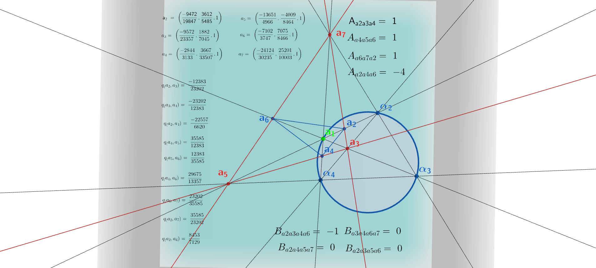

## Picking up where we left off

This is the fifth post in the series exploring the algebra hiding inside a very simple picture: four null points on a conic, and the seven-point figure their diagonal triangle generates.

- **Post 1** ([From Null Quadrangles to xy = 1](https://jcoady.github.io/blog/posts/reciprocal-parallax-symmetry/)) built the fully-right diagonal triangle $\overline{efg}$ from four null points $\alpha_1,\alpha_2,\alpha_3,\alpha_4$, relabeled $e$ as $a_3$ and $\alpha_4$ as $a_1$, and derived the reciprocal law $q_{23}\,q_{34}=1$.
- **Post 2** ([Parallax Diagonal Triangulation](https://jcoady.github.io/blog/posts/parallax-diagonal-triangulation/)) triangulated the diagonal triangle outward and found six segments carrying the full six-element anharmonic orbit of a single parameter $q$.
- **Posts 3-4** built the central-triangle trace-free triple $(Q_1,Q_2,Q_3)$ from $q$ and tied its $S_3$ symmetry to the $A_2$ root system.

Every one of these posts treats $q$ as an abstract free parameter. This post asks a concrete question instead: given an explicit, coordinatized null quadrangle — the kind used in the companion paper *Invariant Quadrea of Orthocenter Triangles from Four Null Points*, where four points are parametrized by a cross-ratio $\lambda$ — what, exactly, is $q$ in terms of $\lambda$? The answer is about as clean as these things get: $q$ is literally the *reciprocal* of the cross-ratio. Getting there required being careful about a subtlety that's easy to gloss over — which we walk through below — and, separately, testing a conjecture about the orbit's origin that turned out to be wrong, which is worth showing rather than hiding.

## Setting the stage: concrete coordinates

Following the orthocenter paper's own parametrization, let $\alpha(t) = [t^2-1 : 2t : t^2+1]$, and fix

$$
\alpha_1=\alpha(-1),\quad \alpha_2=\alpha(0),\quad \alpha_3=\alpha(1),
$$

with the fourth point $\alpha_4$ left to move along the same family. The one thing worth being careful about here: the affine parameter you plug into $\alpha(\cdot)$ for $\alpha_4$ is **not automatically** the cross-ratio $\lambda \equiv (\alpha_1,\alpha_2:\alpha_3,\alpha_4)$. Using the standard cross-ratio formula for affine parameters,

$$
(\alpha_1,\alpha_2:\alpha_3,\alpha_4) = \frac{(t_1-t_3)(t_2-t_4)}{(t_1-t_4)(t_2-t_3)},
$$

setting $t_4$ equal to some free parameter $t$ directly gives cross-ratio $2t/(1+t)$ — a genuine Möbius function of $t$, but not $t$ itself. To make $\lambda$ *actually* the cross-ratio, we instead solve for the affine parameter that produces it:

$$
t_4 = \frac{\lambda}{2-\lambda}, \qquad\text{so that}\qquad \alpha_4 = \alpha\!\left(\frac{\lambda}{2-\lambda}\right).
$$

With that substitution confirmed exactly (verified below), $\lambda$ is honestly the cross-ratio $(\alpha_1,\alpha_2:\alpha_3,\alpha_4)$ — not merely a coordinate that happens to parametrize the same family.

Following Post 1's construction, form the diagonal points

$$
e=(\alpha_1\alpha_2)(\alpha_3\alpha_4),\quad f=(\alpha_1\alpha_3)(\alpha_2\alpha_4),\quad g=(\alpha_1\alpha_4)(\alpha_2\alpha_3),
$$

relabel $a_3=e$ and $a_1=\alpha_4$, and build the two auxiliary points

$$
a_2=(fa_1)\cdot(a_3g), \qquad a_4=(ga_1)\cdot(a_3f).
$$

Computing directly with these coordinates confirms Post 1's claim on an explicit example: the diagonal triangle is fully right, $q(e,f)=q(f,g)=q(e,g)=1$ identically in $\lambda$ — not merely asserted abstractly, but verified on this specific family of points.

## The λ–q dictionary

Computing $q \equiv q(a_2,a_3)$ directly from these coordinates, with $\alpha_4$ correctly parametrized so that $\lambda$ is the genuine cross-ratio, gives the cleanest possible relationship:

$$
\boxed{q = \frac{1}{\lambda}}.
$$

That's it — no extra affine shift, no three-term Möbius map hiding the connection. The parallax parameter driving Posts 2-4 is, up to the choice of which representative of the anharmonic orbit you call "$q$," simply the reciprocal of the raw cross-ratio of the four null points. It's a genuine, if very simple, Möbius reparametrization: $q$ is one specific member of $\lambda$'s own six-element anharmonic orbit, and it happens to be the cleanest one — the plain inverse.

## A conjecture that turned out to be wrong

Post 2 established that $q$ ranges over a full six-element anharmonic $S_3$ orbit. Given the $\lambda$–$q$ dictionary above, the natural guess was that varying which of the four original null points plays the role of $a_1$ — trying $\alpha_1,\alpha_2,\alpha_3,\alpha_4$ in turn, holding $a_3=e$ fixed — would generate the remaining values of $q$'s orbit.

It does not. Direct computation shows $q(a_2,a_3)$ is **identical** for all four choices of $a_1$:

$$
q\big|_{a_1=\alpha_1} = q\big|_{a_1=\alpha_2} = q\big|_{a_1=\alpha_3} = q\big|_{a_1=\alpha_4} = \frac{1}{\lambda}.
$$

This isn't a computational accident — the point $a_2$ itself is genuinely different (its homogeneous coordinates are not proportional) for each choice of $a_1$, yet its quadrance to $a_3$ never changes. Geometrically: $a_2$ always lies on the fixed line $a_3g$, and no matter which null point sweeps out the intersection with that line, the resulting quadrance to $a_3$ is invariant. It's a real, if secondary, invariant of the construction — just not the generator of the orbit we were looking for.

## The actual resolution

The correct generators were already sitting in results already established, once looked at the right way.

**Three values from the choice of diagonal point.** Instead of varying $a_1$, vary which of the three diagonal points $\{e,f,g\}$ plays the role of $a_3$, rebuilding $a_2,a_4$ accordingly each time. This reproduces exactly the three-element rotation subgroup of $\lambda$'s orbit:

$$
a_3=e:\ \frac{1}{\lambda}, \qquad a_3=f:\ \frac{1}{1-\lambda}, \qquad a_3=g:\ \frac{\lambda}{\lambda-1}.
$$

**The remaining three from the reflection already in hand.** Post 1's reciprocal law $q_{23}\,q_{34}=1$ *is* the missing reflection: swapping which of the two constructed points ($a_2$ or $a_4$) you measure the quadrance from $a_3$ sends $q\mapsto 1/q$ directly. Composing this reflection with each of the three rotation values above,

$$
\lambda,\qquad 1-\lambda,\qquad \frac{\lambda-1}{\lambda},
$$

recovers exactly the three remaining anharmonic values — and, satisfyingly, $\lambda$ itself is one of them: the reflection of the $a_3=e$ representative is nothing but the raw cross-ratio.

So the full six-element orbit factors cleanly as

$$
\underbrace{\left\{\tfrac{1}{\lambda},\ \tfrac{1}{1-\lambda},\ \tfrac{\lambda}{\lambda-1}\right\}}_{\text{choice of }a_3\in\{e,f,g\}}\ \times\ \underbrace{\{q,\ 1/q\}}_{\text{choice of }a_2\text{ vs }a_4},
$$

with $3\times 2=6=|S_3|$, each factor tied to a specific, nameable labeling choice in the construction rather than an appeal to abstract symmetry. No new machinery was needed — the reflection was Post 1's founding result all along, and the rotation was a direct consequence of the three-fold symmetry of the diagonal triangle itself.

## Check it yourself

```python
from sympy import symbols, simplify, factor

lam = symbols('lam')

def join(a, b):
    x1, y1, z1 = a; x2, y2, z2 = b
    return (y1*z2 - y2*z1, z1*x2 - z2*x1, x2*y1 - x1*y2)

meet = join  # self-dual formula

def Q(p):
    x, y, z = p
    return x**2 + y**2 - z**2

def B(u, v):
    x1, y1, z1 = u; x2, y2, z2 = v
    return x1*x2 + y1*y2 - z1*z2

def quadrance(a, b):
    return simplify(1 - B(a, b)**2 / (Q(a)*Q(b)))

def alpha(t):
    return (t**2 - 1, 2*t, t**2 + 1)

# Parametrize alpha4 so that lambda is honestly the cross-ratio
# (alpha1, alpha2 : alpha3, alpha4), not just a raw affine coordinate.
t4 = lam / (2 - lam)

a1p, a2p, a3p, a4p = alpha(-1), alpha(0), alpha(1), alpha(t4)

# Sanity check: does this really give cross-ratio = lambda?
t1v, t2v, t3v = -1, 0, 1
cross_ratio = (t1v - t3v)*(t2v - t4) / ((t1v - t4)*(t2v - t3v))
print("cross-ratio check (should be 0):", simplify(cross_ratio - lam))

e = join(join(a1p, a2p), join(a3p, a4p))
f = join(join(a1p, a3p), join(a2p, a4p))
g = join(join(a1p, a4p), join(a2p, a3p))

# Fully-right diagonal triangle: all three side quadrances = 1
print("q(e,f) =", quadrance(e, f))
print("q(f,g) =", quadrance(f, g))
print("q(e,g) =", quadrance(e, g))

def build_q(a3_choice, other1, other2, a1_):
    a2c = meet(join(other1, a1_), join(a3_choice, other2))
    a4c = meet(join(other2, a1_), join(a3_choice, other1))
    return simplify(quadrance(a2c, a3_choice))

a1_role = a4p  # alpha4, as in Post 1

qA = build_q(e, f, g, a1_role)   # a3 = e
qB = build_q(f, e, g, a1_role)   # a3 = f
qC = build_q(g, e, f, a1_role)   # a3 = g

print("\nlambda-q dictionary:  q =", factor(qA), " ( == 1/lambda )")

print("\nRotation subgroup (choice of a3):")
print("a3=e ->", factor(qA), " should equal 1/lam:     ", simplify(qA - 1/lam))
print("a3=f ->", factor(qB), " should equal 1/(1-lam): ", simplify(qB - 1/(1-lam)))
print("a3=g ->", factor(qC), " should equal lam/(lam-1):", simplify(qC - lam/(lam-1)))

print("\nSwapping a1 among all four original points (a3=e fixed):")
for label, a1_try in [("alpha1", a1p), ("alpha2", a2p), ("alpha3", a3p), ("alpha4", a4p)]:
    print(f"  a1={label}: q =", factor(build_q(e, f, g, a1_try)))

# Reflection: swapping a2 <-> a4 sends q -> 1/q, i.e. 1/lambda -> lambda
a2_e = meet(join(f, a1_role), join(e, g))
a4_e = meet(join(g, a1_role), join(e, f))
q23 = quadrance(a2_e, e)
q34 = quadrance(a4_e, e)
print("\nq(a2,e) =", factor(q23), "  q(a4,e) =", factor(q34), "  product:", simplify(q23*q34))
```

```
cross-ratio check (should be 0): 0

q(e,f) = 1
q(f,g) = 1
q(e,g) = 1

lambda-q dictionary:  q = 1/lam  ( == 1/lambda )

Rotation subgroup (choice of a3):
a3=e -> 1/lam  should equal 1/lam:      0
a3=f -> -1/(lam - 1)  should equal 1/(1-lam):  0
a3=g -> lam/(lam - 1)  should equal lam/(lam-1): 0

Swapping a1 among all four original points (a3=e fixed):
  a1=alpha1: q = 1/lam
  a1=alpha2: q = 1/lam
  a1=alpha3: q = 1/lam
  a1=alpha4: q = 1/lam

q(a2,e) = 1/lam  q(a4,e) = lam  product: 1
```

Every identity holds exactly, symbolically, across the whole domain — no numerical approximation, and no special value of $\lambda$ required. The reflection line at the end is worth pausing on: swapping $a_2 \leftrightarrow a_4$ literally sends $1/\lambda \mapsto \lambda$, so the reciprocal law from Post 1 and the raw cross-ratio $\lambda$ turn out to be two ends of the same single Möbius involution.

## Try it yourself in GeoGebra

The interior/exterior structure behind Post 1's Theorem 2 and Post 2's monodromy claims is easy to see directly, without any symbolic algebra. Fix three null points on the null circle and let the fourth one move freely; at every moment, exactly one of the three diagonal points sits inside the circle, and passing the moving point across one of the three fixed points swaps which diagonal point that is. Over one full revolution, each of the three diagonal points takes its turn as the interior one exactly once.

```{=html}
<div style="text-align: center; margin: 20px 0;">
  <a href="https://www.geogebra.org/m/dnapybjg" target="_blank" rel="noopener noreferrer" title="Diagonal Triangle of a Null Quadrangle">
    
    <p style="font-size: 0.9rem; color: #666; margin-top: 8px;"><em>Click image to launch the interactive GeoGebra 3D applet in a new window. Click and drag the points on blue circle to see metric calculations update.</em></p>
  </a>
</div>
```

**To build your own copy:**

1. Place three fixed null points $A, B, C$ on the null circle, and a fourth, draggable null point $D$.
2. Construct the three pairs of "opposite" secant lines — $AB$ & $CD$, $AC$ & $BD$, $AD$ & $BC$ — and their three intersection points; these are the diagonal points $e, f, g$.
3. Color each diagonal point by whether it currently lies inside or outside the null circle.
4. Drag $D$ slowly around the full circle and watch which diagonal point is colored "interior" as $D$ crosses each of $A$, $B$, and $C$ in turn.

You should see exactly one interior point at every moment, a swap at each of the three crossings, and a return to the starting configuration after one full revolution — the same qualitative pattern confirmed algebraically above, now visible directly.

## Where this leaves us

Four posts of abstract cross-ratio algebra now have an explicit, and pleasingly simple, anchor: $q = 1/\lambda$, tying the parallax parameter driving Posts 2-4 directly to the reciprocal of the literal cross-ratio of a concretely coordinatized null quadrangle. Getting a clean answer required being careful about what "$\lambda$" actually meant — the raw affine coordinate of the fourth point is a Möbius function of the true cross-ratio, not the cross-ratio itself, and only after making that distinction explicit does the reciprocal relationship fall out. Along the way, a separate, plausible-looking conjecture about the source of the anharmonic $S_3$ orbit was tested and found false — the choice of which null point plays $a_1$ turns out to be irrelevant to $q$ — and replaced with a cleaner, fully mechanical account: three values from the choice of diagonal point, doubled to six by the reflection already established in Post 1.

With this dictionary in hand, the natural next step is to check whether the diagonal-point transpositions and sign monodromy described in two companion papers, built on the same four-point null quadrangle, reproduce this same six-element orbit under the same labeling rules — putting every construction in the series on one common coordinate system for the first time.

**Series so far:**

1. [From Null Quadrangles to xy = 1](https://jcoady.github.io/blog/posts/reciprocal-parallax-symmetry/)
2. [Parallax Diagonal Triangulation](https://jcoady.github.io/blog/posts/parallax-diagonal-triangulation/)
3. [From Cross-Ratio Orbits to SU(3) Invariants](https://jcoady.github.io/blog/posts/from-cross-ratio-orbits-to-su3-invariants/)
4. [From Trace-Free Triples to the A2 Root System](https://jcoady.github.io/blog/posts/trace-free-triples-to-a2-root-system/)
5. A Concrete Dictionary: Connecting q to λ *(this post)*
