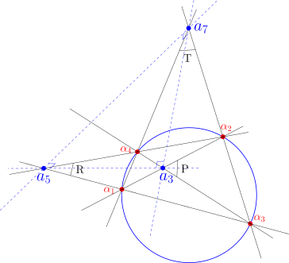
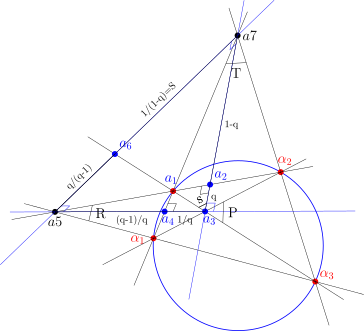
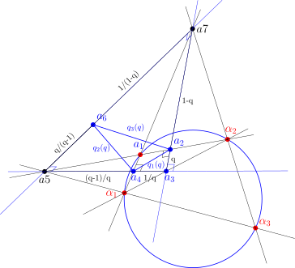

## Picking up where we left off

This is the third post in an ongoing series exploring the algebra hiding inside a very simple picture: four null points sitting on a conic, and the seven-point figure you get when you triangulate the diagonal triangle they generate.

- In [**Post 1: Reciprocal Parallax Symmetry in UHG**](https://jcoady.github.io/blog/posts/reciprocal-parallax-symmetry/), we met the four null points, their self-polar diagonal triangle, and the first hint that its sides carry a rigid, cross-ratio-independent quadrance of exactly $1$.
- In [**Post 2: Parallax Diagonal Triangulation**](https://jcoady.github.io/blog/posts/parallax-diagonal-triangulation/), we triangulated that diagonal triangle outward, picked up six outer parallax segments, and found that their quadrances trace out the full six-element anharmonic orbit of a single cross-ratio parameter $q$.

Both of those posts stayed close to the raw geometry — joins, meets, poles, quadrances. This post is where the payoff shows up: the same six-element orbit, run through one deliberately simple quadratic map, folds down onto a rigid numerical target that Wildberger proved decades ago, and along the way hands us something that looks unmistakably like the invariant structure of $\mathfrak{su}(3)$.

The full write-up, with every derivation carried out in detail, is on Zenodo:

> **From Cross-Ratio Orbits to $SU(3)$ Invariants in Universal Hyperbolic Geometry**
> John D. Coady, 2026. [doi.org/10.5281/zenodo.22398942](https://doi.org/10.5281/zenodo.22398942)

This post is the tour.

## Two tiers, one cross-ratio

Everything in this series is organized into two tiers, both driven by a single free parameter $q \in \mathbb{P}^1(\mathbb{F}) \setminus \{0,1,\infty\}$ — the cross-ratio of the original four null points.

**Tier 2** is the microscopic layer: the six outer parallax quadrances from Post 2, forming the anharmonic $S_3$ orbit

$$
\mathcal{O}_q = \left\{ \{q,\, 1-q\},\ \left\{\tfrac{1}{q},\, \tfrac{q-1}{q}\right\},\ \left\{\tfrac{1}{1-q},\, \tfrac{q}{q-1}\right\} \right\}.
$$

Six numbers, permuted among themselves by the six elements of $S_3$, arranged as three complementary pairs.

**Tier 1** is the macroscopic layer: the diagonal spreads $P$, $R$, $T$ that live on the *original* four-point quadrangle, satisfying Wildberger's classical **Theorem 44** — the "48/64 theorem":

$$
PR + RT + TP = 48, \qquad PRT = 64.
$$

The question this post answers: is there a clean, purely algebraic bridge from Tier 2 to Tier 1? It turns out there is, and it's disarmingly simple.

## The quadratic folding map

Pick one representative from each of the three complementary pairs in $\mathcal{O}_q$ — say $q_1 = q$, $q_2 = 1/q$, $q_3 = 1/(1-q)$ — and feed each one through

$$
f(x) = 4x(1-x).
$$

If that formula looks familiar, it should: it's the logistic map at its most chaotic parameter value, $r=4$. We're not iterating it here — there's no dynamics, no orbit of iterates — but it's worth noting *why* this particular quadratic shows up. Wildberger's **Theorem 32** (UHG II) gives the quadrance opposite an isosceles pair in terms of the shared quadrance $q$ and spread $S$:

$$
q_3 = \frac{4(1-S)\,q(1-q)}{(1-Sq)^2}.
$$

Set $S=0$ — the right-angled special case — and this collapses exactly to $q_3 = 4q(1-q)$. So $f$ isn't an arbitrary choice; it's what the Isosceles Triangle theorem hands you for free once you specialize to a right spread.

Define:

$$
R \equiv 4q(1-q), \qquad
T \equiv 4\left(\frac{1}{q}\right)\!\left(1-\frac{1}{q}\right) = -\frac{4(1-q)}{q^2}, \qquad
P \equiv 4\left(\frac{1}{1-q}\right)\!\left(1-\frac{1}{1-q}\right) = -\frac{4q}{(1-q)^2}.
$$

Here's the key structural fact: $f(x) = f(1-x)$, identically. So it doesn't matter which member of each complementary pair you started from — $f$ can't tell $q$ from $1-q$, or $1/q$ from $(q-1)/q$, or $1/(1-q)$ from $q/(q-1)$. That single symmetry is what turns a **6**-element orbit into a well-defined **3**-element set $\{P, R, T\}$. It's a genuine $2$-to-$1$ branched algebraic cover, no analysis required — just the involution $x \mapsto 1-x$ acting underneath a quadratic.



## Landing exactly on 48 and 64

The remarkable part isn't that $f$ collapses the orbit — it's *where* it lands. Multiply the three definitions together and the denominators cancel outright:

$$
PRT = \big[4q(1-q)\big]\cdot\left[-\frac{4(1-q)}{q^2}\right]\cdot\left[-\frac{4q}{(1-q)^2}\right]
= \frac{64\,q^2(1-q)^2}{q^2(1-q)^2} \equiv 64.
$$

The symmetric sum takes a little more bookkeeping but resolves just as cleanly. Putting everything over $q(1-q)$:

$$
PR + RT + TP = \frac{16\big(-q^3 - (1-q)^3 + 1\big)}{q(1-q)} = \frac{16 \cdot 3q(1-q)}{q(1-q)} \equiv 48,
$$

using the fact that $-q^3 - (1-q)^3 + 1 = 3q(1-q)$ identically. Both reductions hold for *every* $q$ in the domain — not at special points, not approximately, but as exact rational identities.

That means $\{P, R, T\}$, built purely from the microscopic Tier 2 quadrances, sits exactly on the invariant locus $PR+RT+TP=48,\ PRT=64$ that Wildberger's Theorem 44 assigns to the diagonal spreads of the original null quadrangle. The isosceles sub-triangle construction is illustrated below.



## The $SU(3)$-flavored central triangle

Tier 2's orbit does more than fold onto $(P,R,T)$. Back in Post 2, triangulating the diagonal triangle also produced a **central triangle** $\overline{a_2a_4a_6}$, built from the auxiliary points of the seven-point frame. Its three side-quadrances, courtesy of the Projective Pythagorean Theorem, are:

$$
Q_1(q) = \frac{q^2-q+1}{q}, \qquad
Q_2(q) = \frac{q^2-q+1}{q(q-1)}, \qquad
Q_3(q) = -\frac{q^2-q+1}{q-1}.
$$



These three quantities satisfy a trace-free condition, $Q_1+Q_2+Q_3\equiv 0$ — the same shape as three color charges summing to zero on the Cartan subalgebra of $\mathfrak{su}(3)$. That single constraint is what makes the rest of the structure feel so Lie-algebraic: with $e_1=0$, only two independent symmetric invariants remain, $e_2$ and $e_3$, and those are exactly the quadratic and cubic Casimirs:

$$
C_2(q) \equiv Q_1^2+Q_2^2+Q_3^2 = \frac{1}{128}\,j(q), \qquad
C_3(q) \equiv Q_1 Q_2 Q_3 = -\frac{1}{256}\,j(q),
$$

where $j(q) = \dfrac{256(q^2-q+1)^3}{q^2(q-1)^2}$ is the classical Klein $j$-invariant. A rank-2 Lie algebra's invariant ring is freely generated by exactly two Casimirs — and here, two independent invariants fall directly out of a trace-free triple built from nothing but a cross-ratio and the Projective Pythagorean Theorem. We want to be careful about how far to push this: the geometry is exact and provable; the $SU(3)$ language is offered as structural motivation, not as a physical derivation.

## What happens at the boundary

Push $q \to 0$ and the three orbit representatives scatter: $q_1 \to 0$, $q_2 \to \infty$, $q_3 \to 1$. Individually, that sends $R \to 0$, $P \to 0$, and $T \to -\infty$ — but the product $PRT$ doesn't blink. The identity $PRT \equiv 64$ is exact for every $q$ in the domain, so the divergence in $T$ and the vanishing of $P,R$ are locked together by construction, not by a coincidence of limits.

Meanwhile $C_2(q) \to +\infty$ and $C_3(q) \to -\infty$ — the Casimirs blow up exactly at the same null-point collisions where the original quadrangle degenerates. It's a clean picture of boundary behavior with no analysis, no $\varepsilon$–$\delta$, and no continuum limit anywhere in sight: just rational functions doing what rational functions do near their poles.

## Check it yourself

Everything above is exact rational algebra, which means it's exactly the kind of thing a computer algebra system can verify in a few lines. Here's a self-contained `sympy` script that checks the three central identities from this post — run it yourself and watch nothing get rounded.

```{python}
from sympy import symbols, simplify, Rational

q = symbols('q')

# --- Tier 2 -> Tier 1 folding map ---
R = 4*q*(1 - q)
T = 4*(1/q)*(1 - 1/q)
P = 4*(1/(1-q))*(1 - 1/(1-q))

PRT = simplify(P * R * T)
PR_RT_TP = simplify(P*R + R*T + T*P)

print("PRT           =", PRT)          # expect 64
print("PR + RT + TP  =", PR_RT_TP)      # expect 48

# --- SU(3)-flavored central field components ---
Q1 = (q**2 - q + 1) / q
Q2 = (q**2 - q + 1) / (q*(q - 1))
Q3 = -(q**2 - q + 1) / (q - 1)

trace = simplify(Q1 + Q2 + Q3)
print("Q1 + Q2 + Q3  =", trace)         # expect 0

# --- Casimirs vs. the Klein j-invariant ---
j = 256*(q**2 - q + 1)**3 / (q**2*(q - 1)**2)
C2 = simplify(Q1**2 + Q2**2 + Q3**2)
C3 = simplify(Q1*Q2*Q3)

print("C2 - j/128    =", simplify(C2 - j/128))   # expect 0
print("C3 + j/256    =", simplify(C3 + j/256))   # expect 0

# spot-check at a rational point, q = 2
for name, val in [("PRT", PRT), ("PR+RT+TP", PR_RT_TP), ("trace", trace)]:
    print(f"{name} at q=2:", val.subs(q, Rational(2)))
```

Run this and you should see `PRT = 64`, `PR + RT + TP = 48`, and `Q1 + Q2 + Q3 = 0` fall out symbolically — not approximately, not just at $q=2$, but as identities holding across the whole domain.

## Where this leaves us

Three posts in, the pattern is holding up: start from nothing but four null points and a cross-ratio, and the projective incidence geometry — joins, meets, poles, quadrances, spreads — hands back rigid numerical constants (Wildberger's $48/64$) and a trace-free triple whose invariant theory mirrors a rank-2 Lie algebra, all without ever leaving the world of rational functions over a general field.

Next up in the series: pushing this central triangle further and seeing how much of the $SU(3)$ analogy survives contact with an actual root system.

**Full paper:** [From Cross-Ratio Orbits to $SU(3)$ Invariants in Universal Hyperbolic Geometry](https://doi.org/10.5281/zenodo.22398942), John D. Coady, Zenodo, 2026.

**Series so far:**

1. [Reciprocal Parallax Symmetry in UHG](https://jcoady.github.io/blog/posts/reciprocal-parallax-symmetry/)
2. [Parallax Diagonal Triangulation](https://jcoady.github.io/blog/posts/parallax-diagonal-triangulation/)
3. From Cross-Ratio Orbits to $SU(3)$ Invariants *(this post)*
