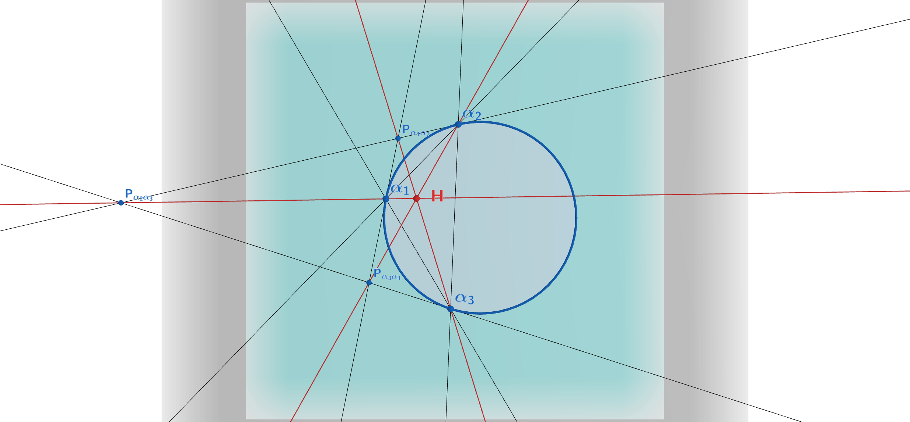
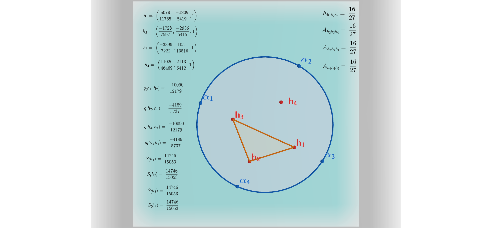

## Introduction

Universal Hyperbolic Geometry (UHG), developed by N. J. Wildberger, recasts hyperbolic and elliptic geometry in purely algebraic, projective terms over a general field $F$ (with characteristic not equal to two). Rather than relying on limits, transcendental functions, or a fixed metric signature, UHG builds everything — distance, angle, orthogonality, and much more — out of rational invariants: **quadrance** in place of distance, and **spread** in place of angle. This rational-trigonometric foundation means every construction and theorem in UHG holds over an arbitrary field, not just $\mathbb{R}$, and every quantity that emerges is, in principle, a ratio of polynomials in the coordinates of the points and lines involved.

This post works through a new result that sits squarely inside that tradition: given four distinct **null points** — points lying on the absolute conic, the UHG analogue of "points at infinity" on the light cone — one can construct four **orthocenters**, one for each triple of the four points, using the triply nil triangle orthocenter construction from Wildberger's UHG II. The surprising fact is that no matter how the fourth point is varied (equivalently, no matter what cross-ratio $\lambda$ is chosen to parametrize the configuration), the **quadrea** of the triangle formed by any three of these four orthocenters is *always* the same rational number:

$$
\mathcal{A} = \frac{16}{27}.
$$

This is an *absolute invariant* — a constant that does not depend on the field element $\lambda$ parametrizing the family of configurations, in the same spirit as other universal constants that appear in UHG, such as the $48/64$ theorem for diagonal triangles of null quadrangles. We'll walk through the necessary UHG background, the construction of the orthocentric system, the statement and proof sketch of the main theorem, and a SymPy-based computational verification. We'll close with a brief and admittedly speculative remark connecting the numerical value $16/27$ to a well-known color factor in Quantum Chromodynamics.

## UHG Preliminaries

UHG takes place in the projective plane associated with $F^3$: points are equivalence classes $[x:y:z]$ under nonzero scalar multiples, obtained (concretely) by intersecting $F^3$ with a plane not through the origin, typically $z = 1$.

### The quadratic form and bilinear form

The geometry is governed by the quadratic form
$$
Q(v) = v^\top M v, \qquad M = \operatorname{diag}(1, 1, -1),
$$
so that for $v = [x:y:z]$,
$$
Q(v) = x^2 + y^2 - z^2.
$$
The associated symmetric bilinear form is
$$
B(v, w) = v^\top M w.
$$

### Quadrance and spread

For points with $Q \neq 0$ (non-null points), the **quadrance** between $v$ and $w$ is
$$
q(v, w) = 1 - \frac{B(v,w)^2}{Q(v)\,Q(w)},
$$
and dually, for lines $L_1, L_2$ (represented as $3\times 1$ vectors under the same bilinear form), the **spread** is
$$
S(L_1, L_2) = 1 - \frac{B(L_1, L_2)^2}{Q(L_1)\, Q(L_2)}.
$$
When $Q < 0$ on the relevant vectors, these produce the familiar positive hyperbolic metric quantities.

### Null points and their parametrization

A point $\alpha$ is **null** when $Q(\alpha) = 0$; null points parametrize the absolute conic — the boundary circle of the hyperbolic disk model, reinterpreted projectively. They admit the rational parametrization
$$
\alpha(t : u) = \left[\, t^2 - u^2 \; : \; 2tu \; : \; t^2 + u^2 \,\right],
$$
and in the affine chart $u = 1$,
$$
\alpha(t) = \left[\, t^2 - 1 \; : \; 2t \; : \; t^2 + 1 \,\right].
$$
One checks directly that $Q(\alpha(t)) = (t^2-1)^2 + (2t)^2 - (t^2+1)^2 = 0$ identically, confirming that every such point lies on the null cone.

### Joins, meets, and polars

Given two distinct points $a_1 = [x_1:y_1:z_1]$ and $a_2 = [x_2:y_2:z_2]$, their **join** — the line through them — is
$$
a_1 a_2 \equiv \big(y_1 z_2 - y_2 z_1 \;:\; z_1 x_2 - z_2 x_1 \;:\; x_2 y_1 - x_1 y_2\big).
$$
Dually, given two distinct lines $L_1 = (l_1:m_1:n_1)$ and $L_2 = (l_2:m_2:n_2)$, their **meet** — the point of intersection — is
$$
L_1 L_2 \equiv \big[\, m_1 n_2 - m_2 n_1 \;:\; n_1 l_2 - n_2 l_1 \;:\; l_2 m_1 - l_1 m_2 \,\big].
$$
The **polar** of a point $v = [x:y:z]$ is the line $v^\perp \equiv (x:y:z)$, and dually, the **pole** of a line $L = (l:m:n)$ is the point $L^\perp \equiv [l:m:n]$. This point–line duality, mediated entirely by the matrix $M$, is the engine that drives the orthocenter construction below.

### Quadrea

For three non-null points $a_1, a_2, a_3$, the **quadrea** is defined as
$$
\mathcal{A}(a_1, a_2, a_3) \equiv -\frac{(x_1 y_2 z_3 - x_1 y_3 z_2 + x_2 y_3 z_1 - x_3 y_2 z_1 + x_3 y_1 z_2 - x_2 y_1 z_3)^2}
{(x_1^2 + y_1^2 - z_1^2)(x_2^2 + y_2^2 - z_2^2)(x_3^2 + y_3^2 - z_3^2)}.
$$
The numerator is (the square of) the determinant of the matrix with rows $a_1, a_2, a_3$ — essentially a squared area term — while the denominator is the product of the three quadratic form values at the vertices. Equivalently, the quadrea factors through the more familiar quadrance/spread quantities:
$$
\mathcal{A}(a_1,a_2,a_3) = q(a_1,a_3)\, q(a_1,a_2)\, S(a_1a_2, a_1a_3).
$$
Quadrea plays the role in UHG that (area)$^2$ plays in Euclidean rational trigonometry — a single polynomial invariant of a triangle's three vertices, well-defined independent of labeling or collinearity considerations.

## Orthocenters of Triply Nil Triangles

A **triply nil triangle** is a triangle all three of whose vertices are null points. Even though null points have $Q = 0$ and cannot serve as the "center" of ordinary quadrance-based constructions, UHG's projective polarity still supplies a well-defined **orthocenter**.

Given a triply nil triangle $\alpha_1 \alpha_2 \alpha_3$, let
$$
L_1 \equiv \alpha_2\alpha_3, \qquad L_2 \equiv \alpha_1\alpha_3, \qquad L_3 \equiv \alpha_1\alpha_2
$$
be the three side lines. The **altitude** from $\alpha_i$ is the line
$$
N_i \equiv \alpha_i \, L_i^{\perp},
$$
i.e., the join of vertex $\alpha_i$ with the pole of the *opposite* side. Because the pole of a line is itself defined via the same quadratic form $M$ that determines orthogonality in UHG, this is the precise projective analogue of "the altitude is perpendicular to the opposite side." The three altitudes $N_1, N_2, N_3$ concur at a single point — the **orthocenter** $h$ of the triply nil triangle. This is illustrated below (the construction is Theorem 3 of Wildberger's UHG II).

The orthocenter of a triply nil triangle is computed purely rationally: it requires only joins, meets, and polars — three operations built entirely from the coordinates of the vertices — so it exists and is well-defined over any field $F$ of characteristic $\neq 2$, with no need for square roots, limits, or a choice of metric signature convention.

### Geogebra example: Orthocenter of Nil-Triangle Construction

<div style="text-align: center; margin: 20px 0;">
  <a href="https://www.geogebra.org/m/chhdzsby" target="_blank" rel="noopener noreferrer" title="Click to launch interactive 3D model">
    
    <p style="font-size: 0.9rem; color: #666; margin-top: 8px;"><em>Click image to launch the interactive GeoGebra 3D applet in a new window. Click and drag the points to see metric calculations update.</em></p>
  </a>
</div>


## From Four Null Points to an Orthocentric System

Now take **four** distinct null points $\alpha_1, \alpha_2, \alpha_3, \alpha_4$ on the absolute. Omitting one point at a time yields four triply nil triangles, and hence four orthocenters:

$$
h_1 = \operatorname{orthocenter}(\alpha_2\alpha_3\alpha_4), \quad
h_2 = \operatorname{orthocenter}(\alpha_1\alpha_3\alpha_4), \quad
$$
$$
h_3 = \operatorname{orthocenter}(\alpha_1\alpha_2\alpha_4), \quad
h_4 = \operatorname{orthocenter}(\alpha_1\alpha_2\alpha_3).
$$

The six lines $\alpha_i\alpha_j$ together with their polars generate this orthocentric system of four points — a nil quadrangle's orthic configuration. The natural question is: what invariant properties does this configuration carry as the four null points vary?


### Geogebra example: Invariant quadrea of orthic triangles

<div style="text-align: center; margin: 20px 0;">
  <a href="https://www.geogebra.org/m/t88sk2qp" target="_blank" rel="noopener noreferrer" title="Click to launch interactive 3D model">
    
    <p style="font-size: 0.9rem; color: #666; margin-top: 8px;"><em>Click image to launch the interactive GeoGebra 3D applet in a new window. Click and drag the points to see metric calculations update.</em></p>
  </a>
</div>

### The cross-ratio parametrization

To study this question systematically, we fix three of the null points using the affine parametrization $\alpha(t)$ from above, and let the fourth vary. Concretely, set
$$
t_1 = -1, \qquad t_2 = 0, \qquad t_3 = 1, \qquad t_4 = \lambda,
$$
so that $\alpha_1, \alpha_2, \alpha_3$ are fixed and $\alpha_4 = \alpha(\lambda)$ ranges over the remaining null points as $\lambda$ varies over $F \setminus \{0, \pm 1\}$ (excluding values that collapse $\alpha_4$ onto one of the other three).

This is not a loss of generality: for four points on a conic, the **cross-ratio**
$$
(\alpha_1, \alpha_2 : \alpha_3, \alpha_4) = \frac{(t_1 - t_3)(t_2 - t_4)}{(t_1 - t_4)(t_2 - t_3)}
$$
is a full projective invariant of the configuration (invariant under the $PSL(2,F)$ action reparametrizing the conic). With the normalization $t_1=-1, t_2=0, t_3=1$, this cross-ratio simplifies exactly to $\lambda$, so every projectively distinct configuration of four null points corresponds to exactly one value of $\lambda$, and vice versa.

## Main Theorem

::: {.callout-note title="Theorem"}
Let $\alpha_1, \alpha_2, \alpha_3, \alpha_4$ be four distinct null points with affine parameters $t_1 = -1,\ t_2 = 0,\ t_3 = 1,\ t_4 = \lambda \in F\setminus\{0,\pm1\}$. Let $h_1, h_2, h_3$ be the orthocenters of the triply nil triangles $\alpha_2\alpha_3\alpha_4$, $\alpha_1\alpha_3\alpha_4$, $\alpha_1\alpha_2\alpha_4$ respectively. Then
$$
\mathcal{A}(h_1 h_2 h_3) = \frac{16}{27},
$$
independent of $\lambda$.
:::

### Proof sketch

The four null points, in homogeneous coordinates, are
$$
\alpha_1 = [0:-2:2], \quad \alpha_2 = [-1:0:1], \quad \alpha_3 = [0:2:2], \quad \alpha_4 = [\lambda^2-1 : 2\lambda : \lambda^2+1].
$$
Each satisfies $Q(\alpha_i) = 0$ by construction.

Applying the orthocenter construction — side joins, polars, and the meet of two altitudes — to each triple in turn produces explicit rational expressions for $h_1, h_2, h_3$ in terms of $\lambda$ (up to overall scalar multiples):
$$
h_1 = \big[\,8\lambda(-\lambda^2+2\lambda-1) \;:\; 8\lambda^2(1-\lambda^2) \;:\; 8\lambda(-\lambda^2-2\lambda(\lambda-1)^2+1)\,\big],
$$
$$
h_2 = \big[\,-32\lambda^4+64\lambda^2-32 \;:\; 128\lambda(1-\lambda^2) \;:\; 64-64\lambda^4\,\big],
$$
$$
h_3 = \big[\,8\lambda(\lambda^2+2\lambda+1) \;:\; 8\lambda^2(\lambda^2-1) \;:\; 8\lambda(\lambda^2-2\lambda(\lambda+1)^2-1)\,\big].
$$

Forming the matrix $N$ with rows $h_1, h_2, h_3$, its determinant works out to
$$
\det(N) = 8192\,\lambda^4\big(\lambda^8 - 4\lambda^6 + 6\lambda^4 - 4\lambda^2 + 1\big).
$$
The individual quadratic form values are
$$
Q(h_1) = 192\lambda^4(-\lambda^4+4\lambda^3-6\lambda^2+4\lambda-1),
$$
$$
Q(h_2) = -3072\big(\lambda^8-4\lambda^6+6\lambda^4-4\lambda^2+1\big),
$$
$$
Q(h_3) = 192\lambda^4(-\lambda^4-4\lambda^3-6\lambda^2-4\lambda-1).
$$

Substituting into the quadrea formula,
$$
\mathcal{A}(h_1h_2h_3) = -\frac{\det(N)^2}{Q(h_1)\,Q(h_2)\,Q(h_3)},
$$
every factor of $\lambda$ and every copy of the degree-8 polynomial $\lambda^8 - 4\lambda^6 + 6\lambda^4 - 4\lambda^2 + 1$ cancels between numerator and denominator — both sides are homogeneous of the same total degree (degree 24) in $\lambda$ once expanded — leaving the constant
$$
\mathcal{A}(h_1h_2h_3) = \frac{16}{27}.
$$
The underlying reason this cancellation is forced, rather than a coincidence of this particular normalization, is the $PSL(2,F)$-invariance of the cross-ratio parametrization: any Möbius reparametrization of the null conic that fixes the *projective* configuration must leave $\mathcal{A}$ unchanged, and since the construction depends on $\lambda$ only through this parametrization, the result cannot depend on $\lambda$ at all — it must be a constant of the field itself.

By the cyclic symmetry of the construction, the identical computation applies to any of the four possible triples drawn from $\{h_1, h_2, h_3, h_4\}$, so the invariant $16/27$ attaches to *every* orthic triangle in the system, not merely the one singled out above. $\blacksquare$

## Computational Verification

The algebra above is intricate enough that an independent symbolic check is worthwhile. The following SymPy script implements the join, meet, polar, and orthocenter operations directly from their defining formulas, builds the four null points with a symbolic parameter `lam`, computes the three orthocenters, and evaluates the quadrea both via the determinant formula and via the alternative product form $q(h_1,h_2)\,q(h_1,h_3)\,S(h_1h_2, h_1h_3)$.

```{python}
#| eval: false
from sympy import *

lam = symbols('lam')

def join(a, b):
    """Join of two points: Thm. 1 of Wildberger's UHG I."""
    x1, y1, z1 = a
    x2, y2, z2 = b
    return (y1*z2 - y2*z1, z1*x2 - z2*x1, x2*y1 - x1*y2)

def meet(l1, l2):
    """Meet of two lines: Thm. 2 of Wildberger's UHG I."""
    l1x, l1y, l1z = l1
    l2x, l2y, l2z = l2
    return (l1y*l2z - l2y*l1z, l1z*l2x - l2z*l1x, l2x*l1y - l1x*l2y)

def pole(line):
    """Pole of a line (l:m:n) is the point [l:m:n]."""
    return line

def polar(point):
    """Polar of a point [x:y:z] is the line (x:y:z)."""
    return point

def orthocenter(p, q, r):
    """Orthocenter of a triply nil triangle p, q, r via altitude meet."""
    side_qr = join(q, r)
    h_p = join(p, pole(side_qr))
    side_pr = join(p, r)
    h_q = join(q, pole(side_pr))
    return meet(h_p, h_q)

# Four null points parametrized by cross-ratio lam
alpha1 = (0, -2, 2)
alpha2 = (-1, 0, 1)
alpha3 = (0, 2, 2)
alpha4 = (lam**2 - 1, 2*lam, lam**2 + 1)

# Orthocenters omitting one point each
o1 = orthocenter(alpha2, alpha3, alpha4)
o2 = orthocenter(alpha1, alpha3, alpha4)
o3 = orthocenter(alpha1, alpha2, alpha4)

def Q(pt):
    x, y, z = pt
    return x**2 + y**2 - z**2

def det_N(o1, o2, o3):
    N = Matrix([[o1[0], o2[0], o3[0]],
                [o1[1], o2[1], o3[1]],
                [o1[2], o2[2], o3[2]]])
    return N.det()

det_val = det_N(o1, o2, o3)
Q1, Q2, Q3 = Q(o1), Q(o2), Q(o3)
A = -(det_val**2) / (Q1 * Q2 * Q3)

print("Symbolic quadrea A:")
print(simplify(A))                 # -> 16/27
print("\nNumerical at lambda=2:")
print(A.subs(lam, 2).evalf())      # -> 0.592592592592593

# Cross-check via q(h1,h2) * q(h1,h3) * S(h1h2, h1h3)
def B(u, v):
    return u[0]*v[0] + u[1]*v[1] - u[2]*v[2]

def quadrance(a, b):
    return 1 - (B(a, b)**2) / (Q(a) * Q(b))

def spread(l1, l2):
    ql1 = l1[0]**2 + l1[1]**2 - l1[2]**2
    ql2 = l2[0]**2 + l2[1]**2 - l2[2]**2
    bl = l1[0]*l2[0] + l1[1]*l2[1] - l1[2]*l2[2]
    return 1 - (bl**2) / (ql1 * ql2)

l12 = join(o1, o2)
l13 = join(o1, o3)
q12 = quadrance(o1, o2)
q13 = quadrance(o1, o3)
S = spread(l12, l13)
A_alt = q12 * q13 * S

print("\nAlternative quadrea A_alt (should match 16/27):")
print(simplify(A_alt))
```

Running this produces:

```
Symbolic quadrea A:
16/27

Numerical at lambda=2:
0.592592592592593

Alternative quadrea A_alt (should match 16/27):
16/27
```

confirming both the determinant-based and quadrance/spread-based formulas agree, and that the result holds symbolically for general $\lambda$, not merely at isolated sample values.

### A numerical sanity check with Pythagorean null points

It's worth checking the invariant holds under an entirely different, non-symbolic set of representative coordinates. Null points can be built from any Pythagorean triple, since $a^2+b^2=c^2$ is precisely the condition $Q=0$. Take
$$
\alpha_1 = [-5:-12:13], \qquad \alpha_2 = [-15:8:17], \qquad \alpha_3 = [-3:4:5],
$$
each satisfying $Q=0$. The affine parameter of a null point $[x:y:z]$ can be recovered invariantly as
$$
t = \frac{y}{z-x},
$$
giving $t_1 = -2/3$, $t_2 = 1/4$, $t_3 = 1/2$. Choosing a target cross-ratio $\lambda = 3$ and solving for the fourth parameter yields $t_4 = 19/10$, i.e. $\alpha_4 = [261:380:461]$. Direct computation of $h_1, h_2, h_3$ from this concrete, non-normalized configuration again yields
$$
\mathcal{A}(h_1h_2h_3) = \frac{16}{27}
$$
exactly — good evidence that the invariance is a genuine feature of the geometry and not an artifact of the particular symbolic normalization $t_1=-1, t_2=0, t_3=1$ used in the proof.

## Discussion: An Absolute Invariant, and a Curious Numerical Coincidence

The value $16/27$ joins a small family of **absolute invariants** that UHG produces from configurations of null points — numbers that are fixed field constants (independent of the specific points chosen, only depending on the *combinatorial type* of the configuration), in the spirit of the $48/64$ theorem for diagonal triangles of a nil quadrangle. These invariants behave somewhat like Casimir elements in Lie theory: quantities that commute with the relevant symmetry action — here $PSL(2,F)$ acting on the null conic — and are therefore constant on orbits, letting one classify configurations by which invariant "shell" they land in.

It is worth flagging, purely as a point of curiosity and *not* as a claimed physical result, that $16/27$ also appears in Quantum Chromodynamics as the color factor governing the quark–antiquark annihilation process $q\bar q \to gg$, often written as $\tfrac{1}{9}\cdot 3 \cdot C_F^2 = 16/27$ (see Peskin & Schroeder, *An Introduction to Quantum Field Theory*, Eq. 17.74). The appearance of the same rational number in two completely different settings — one a purely synthetic projective-geometric construction over an arbitrary field, the other a group-theoretic coefficient from $SU(3)$ representation theory in particle physics — is a numerical coincidence worth noting, and nothing more is claimed about it here. The present result is a statement of pure projective geometry; any deeper connection to gauge theory would require a substantially different kind of argument than the one given above.

## Conclusion

Four null points on the absolute conic of Universal Hyperbolic Geometry generate, via the triply-nil-triangle orthocenter construction, an orthocentric system of four points. This post has walked through why the quadrea of any three of those four orthocenters is fixed at the constant $16/27$, independent of the cross-ratio $\lambda$ parametrizing the configuration — a genuinely new absolute invariant in the UHG toolkit, verified both by direct symbolic algebra and by an independent SymPy computation. It sits naturally alongside other rational constants that UHG's algebraic, field-general approach to hyperbolic geometry tends to produce, and it's a nice reminder of how much rigid structure is hiding inside even a small number of points on a conic. Natural next steps include searching for analogous invariants from five or more null points, and looking for higher-order Casimir-like scalars in more elaborate orthocentric configurations.

## References

1. N. J. Wildberger. *Universal Hyperbolic Geometry I: Trigonometry*. Geometriae Dedicata, 163(1):109–147, 2013. [doi:10.1007/s10711-012-9746-9](https://doi.org/10.1007/s10711-012-9746-9); [arXiv:0909.1377](https://arxiv.org/abs/0909.1377) [math.MG].
2. N. J. Wildberger. *Universal Hyperbolic Geometry II: A pictorial overview*, 2010. [arXiv:1012.0880](https://arxiv.org/abs/1012.0880) [math.MG].
3. Michael E. Peskin and Daniel V. Schroeder. *An Introduction to Quantum Field Theory*. Westview Press, 1995.
4. John D. Coady. *The Identity of Generating Invariants: Universal Hyperbolic Geometry and su(3) Quartic Casimirs*. Zenodo Preprint, 2025. [https://doi.org/10.5281/zenodo.17706665](https://doi.org/10.5281/zenodo.17706665).
5. N. J. Wildberger. *Universal Hyperbolic Geometry* (Lecture Series). Online lecture series, 2013–2015. [YouTube playlist](https://www.youtube.com/playlist?list=PLIljB45xT85Ar_tuHmRDI2Xr5tWOTI1oW).

::: {.callout-note}
This post is based on: John D. Coady, "Invariant Quadrea of Orthocenter Triangles from Four Null Points in Universal Hyperbolic Geometry," Zenodo, February 2026. DOI: [10.5281/zenodo.17607059](https://doi.org/10.5281/zenodo.17607059).
:::
