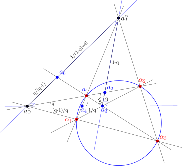
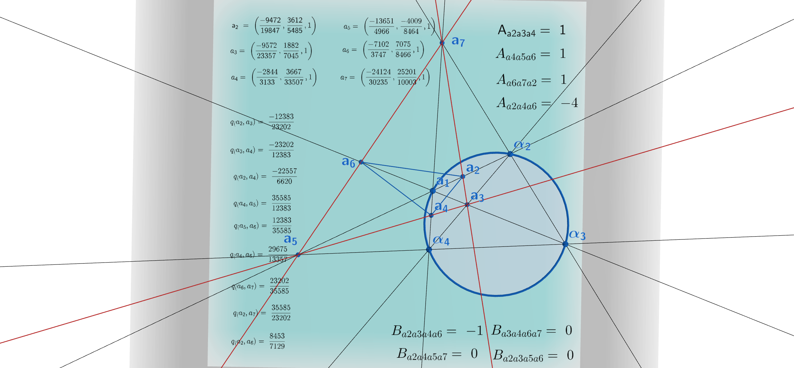

## Picking up where we left off

The [previous post](https://jcoady.github.io/blog/posts/reciprocal-parallax-symmetry/) started with a null quadrangle, built its fully-right diagonal triangle, and showed that a pair of "complementary parallax triangles" hanging off one vertex of that diagonal triangle carry reciprocal quadrances $q$ and $1/q$. This post extends that picture all the way around the diagonal triangle, and asks what happens when we triangulate it with the seven points that result.

The punchline is twofold. First, the *entire* diagonal triangle can be cut into four smaller triangles whose projective quadreas are each exactly $1$, glued against a central triangle whose quadrea is exactly $-4$ — and the five numbers sum to zero. Second, every quadrance that shows up anywhere in the construction turns out to be one of the six classical values of the anharmonic group of a single cross-ratio $q$. The reciprocal symmetry $q \leftrightarrow 1/q$ from the last post was only one face of a much richer six-fold symmetry hiding in the configuration.

## Setting the stage: a completely right diagonal triangle

We start, as before, with a null quadrangle and form its diagonal triangle — except this time we label its three vertices $a_3, a_5, a_7$. This diagonal triangle is **completely right**: all three side quadrances equal $1$,

$$q(a_3,a_5) = q(a_5,a_7) = q(a_3,a_7) = 1,$$

and all three vertex spreads equal $1$ as well. Every side is perpendicular to the line joining the other two vertices, and every side has the same unit quadrance — the most symmetric triangle UHG has to offer.

Now take a null point $a_1$ lying on the null circle, chosen to be one of the vertices of the original null quadrangle that produced this diagonal triangle. Building the two complementary right triangles at $a_3$ exactly as in the previous post reproduces the same parallax configuration:

$$q(a_2,a_3) = q, \qquad q(a_3,a_4) = \frac{1}{q}.$$

The new content of this post is what happens when we keep going — using the other two vertices $a_5$ and $a_7$ of the diagonal triangle to generate two more points, $a_6$ and, together with $a_2$ and $a_4$, close the whole figure into a seven-point configuration built entirely by triangulating the diagonal triangle $a_3a_5a_7$.



## Walking the chain of quadrances

The key tool throughout is the **Triple Quad Formula** (TQF), which governs any three collinear points $p,q,r$ with quadrances $q_1=q(p,q)$, $q_2=q(q,r)$, $q_3=q(p,r)$:

$$(q_1+q_2+q_3)^2 = 2(q_1^2+q_2^2+q_3^2) + 4q_1q_2q_3.$$

Whenever one of the three quadrances is exactly $1$, this collapses to a perfect square, and the other two become simple affine complements of one another.

**From $a_3,a_4$ to $a_4,a_5$.** Since $q(a_3,a_5)=1$ (a side of the diagonal triangle) and $q(a_3,a_4)=1/q$, feeding $q_1 = 1/q$, $q_3=1$ into the TQF forces $(q_2 - (1-1/q))^2=0$, i.e.

$$q(a_4,a_5) = 1-\frac{1}{q}.$$

**From $a_2,a_3$ to $a_2,a_7$.** By the identical argument, using $q(a_3,a_7)=1$ and $q(a_2,a_3)=q$,

$$q(a_2,a_7) = 1-q.$$

**Crossing over to $a_6$ via the spread law.** The vertex $a_3$ of the diagonal triangle is the pole of the opposite side $a_5a_7$, so the line $a_3a_7$ is perpendicular to $a_5a_7$, and the spread at $a_7$ in triangle $a_3a_6a_7$ is $1$. Applying the Spread Law to that triangle,

$$\frac{S}{q(a_6,a_7)} = \frac{S(a_3a_6,a_6a_7)}{q(a_3,a_7)} = \frac{S(a_3a_7,a_6a_7)}{q(a_3,a_6)} = \frac{1}{1},$$

using $q(a_3,a_7)=q(a_3,a_6)=1$. So $q(a_6,a_7) = S$, and since this spread obeys the same right-parallax relation $q=(S-1)/S$ from the earlier post — now solved for $S$ in terms of the original parallax quadrance $q$ — we get

$$q(a_6,a_7) = \frac{1}{1-q}.$$

**Closing the loop at $a_5,a_6$.** Finally, $a_5$ and $a_7$ are the perpendicular pair with $q(a_5,a_7)=1$, so the same collapsed TQF argument used above (this time on the collinear triple $a_5,a_6,a_7$) gives

$$q(a_5,a_6) = 1-q(a_6,a_7) = 1-\frac{1}{1-q}.$$

## The six faces of a cross-ratio

Simplifying $q(a_5,a_6)$ gives $\dfrac{q}{q-1}$, and collecting every quadrance derived above:

| Segment | Quadrance | Cross-ratio form |
|---|---|---|
| $a_2a_3$ | $q$ | $\lambda$ |
| $a_3a_4$ | $1/q$ | $1/\lambda$ |
| $a_4a_5$ | $1-1/q$ | $(\lambda-1)/\lambda$ |
| $a_2a_7$ | $1-q$ | $1-\lambda$ |
| $a_6a_7$ | $1/(1-q)$ | $1/(1-\lambda)$ |
| $a_5a_6$ | $q/(q-1)$ | $\lambda/(\lambda-1)$ |

These are precisely the six values of the classical **anharmonic group** generated by permuting a cross-ratio $\lambda = q$:

$$q,\quad \frac{1}{q},\quad 1-q,\quad \frac{1}{1-q},\quad \frac{q}{q-1},\quad \frac{q-1}{q}.$$

Every quadrance produced by triangulating the diagonal triangle is one of these six values — nothing else appears. The reciprocal law $q\leftrightarrow 1/q$ from the earlier post is just one of the three involutions in this group (the other two being $q\leftrightarrow 1-q$ and $q\leftrightarrow q/(q-1)$); the full six-point construction realizes the whole $S_3$ symmetry of the cross-ratio at once, with each of the six segments of the figure carrying a different one of its six values.

## An invariant quadrea of exactly one, four times over

The seven points triangulate the diagonal triangle $a_3a_5a_7$ into four small triangles meeting at the central point of the figure. Each of these four triangles has a right angle where two of its sides meet a segment of unit quadrance, and in every case the **quadrea** $\mathcal{A} = q_1q_2S_3$ collapses the same way it did in the previous post:

$$\mathcal{A}(a_2,a_3,a_4) = q\cdot\frac1q\cdot 1 = 1,$$

and identical computations — swapping in the corresponding reciprocal pair of quadrances at each right angle — give

$$\mathcal{A}(a_4,a_5,a_6) = 1, \qquad \mathcal{A}(a_2,a_6,a_7) = 1.$$

The fourth triangle is the original diagonal triangle itself, $a_3a_5a_7$, whose quadrea is likewise $1$ since all three sides and all three spreads are exactly $1$:

$$\mathcal{A}(a_3,a_5,a_7) = 1\cdot1\cdot1 = 1.$$

So all **four** triangles that triangulate the outer edge of the figure have unit quadrea, regardless of $q$.

**The central triangle.** The fifth triangle in the picture, $a_2a_4a_6$, sits in the middle where the other four meet, and each of its three sides is shared with one of the adjacent right triangles. That means each side quadrance of the central triangle can be read off directly from the **Projective Pythagorean Theorem**: whenever a spread of $1$ sits between two points $B$ flanked by $A$ and $C$,

$$q(A,C) = q(A,B) + q(B,C) - q(A,B)\,q(B,C).$$

Applying this across each of the three right angles adjacent to the central triangle:

$$q(a_2,a_4) = q(a_2,a_3) + q(a_3,a_4) - q(a_2,a_3)\,q(a_3,a_4),$$
$$q(a_4,a_6) = q(a_4,a_5) + q(a_5,a_6) - q(a_4,a_5)\,q(a_5,a_6),$$
$$q(a_2,a_6) = q(a_2,a_7) + q(a_6,a_7) - q(a_2,a_7)\,q(a_6,a_7).$$

Each right-hand side plugs in one of the reciprocal pairs from the cross-ratio table above — $(q,\,1/q)$, $((q-1)/q,\,q/(q-1))$, and $(1-q,\,1/(1-q))$ respectively — so all three sides of the central triangle are determined purely in terms of $q$:

$$Q_1 = q(a_2,a_4) = q-1+\frac1q, \quad Q_2 = q(a_4,a_6) = \frac{q^2-q+1}{q(q-1)}, \quad Q_3 = q(a_2,a_6) = \frac{-q^2+q-1}{q-1}.$$

Two more invariants fall out immediately once these are collected: **the three side quadrances of the central triangle always sum to zero**, $Q_1+Q_2+Q_3=0$, and their complements always multiply to one, $(1-Q_1)(1-Q_2)(1-Q_3)=1$ — both identities hold for every value of $q$.

That is exactly what's needed to finish the job with the genuinely projective **Cross Law** (Wildberger, *Universal Hyperbolic Geometry III*, Thm. 50), the projective analogue of the Cosine Law. For a triangle with quadrances $q_1,q_2,q_3$, spread $S_1$ opposite $q_1$, and quadrea $\mathcal{A}=q_2q_3S_1$ (the Quadrea Theorem), the Cross Law states

$$\big(\mathcal{A} - q_1-q_2-q_3+2\big)^2 = 4(1-q_1)(1-q_2)(1-q_3).$$

Substituting $q_1+q_2+q_3=0$ and $(1-q_1)(1-q_2)(1-q_3)=1$ for the central triangle collapses this to

$$(\mathcal{A}+2)^2 = 4,$$

so $\mathcal{A}(a_2,a_4,a_6)$ can only be $0$ or $-4$ — and since the central triangle is manifestly non-degenerate, the geometrically realized root is

$$\mathcal{A}(a_2,a_4,a_6) = -4.$$

Summing every triangle quadrea in the triangulation of the diagonal triangle,

$$\mathcal{A}(a_2a_3a_4) + \mathcal{A}(a_4a_5a_6) + \mathcal{A}(a_2a_6a_7) + \mathcal{A}(a_3a_5a_7) - \mathcal{A}(a_2a_4a_6) = 1+1+1+1-4 = 0,$$

taking the central triangle with a minus sign, as its orientation runs opposite to the four outer triangles. The whole triangulated figure balances to zero — the four unit "petals" exactly cancel the central $-4$.

## Doubly-right quadrangles: quadrea zero

Grouping the seven points into quadrangles instead of triangles turns up a second family of invariants. The quadrangles $a_2a_3a_5a_6$, $a_4a_5a_7a_2$, and $a_6a_7a_3a_4$ are each **doubly-right**: two adjacent spreads of the quadrangle are equal to $1$.

For a doubly-right quadrangle with the three side quadrances $a$, $b$, $c$ running around the sides adjacent to the two right spreads, the projective quadrea is given by

$$\mathcal{A} = ab+bc-abc.$$

In each of our three quadrangles the middle quadrance is $b=1$ (a side shared with the diagonal triangle), which reduces the formula to

$$\mathcal{A} = a+c-ac.$$

Reading off the quadrances from the table above — each pair $(a,c)$ is one of the reciprocal pairs generated by the anharmonic group, such as $(q,\,1/q)$ or $(1-q,\,1/(1-q))$ — the relation $a+c=ac$ holds identically, since dividing through by $ac$ gives $1/a + 1/c = 1$, which is exactly the complementary-spread relation the whole construction was built from. So

$$\mathcal{A}(a_2a_3a_5a_6) = \mathcal{A}(a_4a_5a_7a_2) = \mathcal{A}(a_6a_7a_3a_4) = 0$$

for every value of $q$: these three quadrangles are invariantly flat, in the projective quadrea sense, no matter where $a_1$ sits on the null circle.

## Singly-right quadrangles: quadrea minus one

A third family — $a_2a_3a_4a_6$, $a_4a_5a_7a_2$, and $a_6a_7a_3a_4$ — is only **singly-right**: a single spread of the quadrangle, at one vertex, equals $1$. For these, the quadrea is just the signed sum of the two triangle quadreas meeting at that right-angled vertex.

Take $a_2a_3a_4a_6$ as the worked example. The spread at $a_3$ is $1$, so the quadrangle splits into triangles $a_2a_3a_6$ and $a_3a_4a_6$ at that vertex. Writing $S=1/(1-q)$ for the spread computed above,

$$\mathcal{A}(a_2,a_3,a_6) = q\cdot S\cdot 1 = q\cdot\frac{1}{1-q} = \frac{q}{1-q},$$

$$\mathcal{A}(a_3,a_4,a_6) = \frac1q\cdot(1-S)\cdot 1 = \frac1q\left(1-\frac{1}{1-q}\right) = \frac1q\cdot\frac{-q}{1-q} = \frac{-1}{1-q}.$$

Adding the two triangle quadreas:

$$\mathcal{A}(a_2a_3a_4a_6) = \frac{q}{1-q} - \frac{1}{1-q} = \frac{q-1}{1-q} = -1.$$

The same computation, run at the appropriate right-angled vertex of the other two quadrangles, gives the identical constant. So every singly-right quadrangle in the figure has projective quadrea exactly $-1$, again independent of $q$.

## Two invariant constants, zero and minus one

Putting the triangle and quadrangle results together, the diagonal triangle's triangulation carries exactly two invariant quadrea values beyond the unit quadreas of its four component triangles:

- **Doubly-right quadrangles** — two right spreads — always have quadrea $\mathbf{0}$.
- **Singly-right quadrangles** — one right spread — always have quadrea $\mathbf{-1}$.

Both invariants trace back to the same source as the unit triangle quadreas and the six-fold cross-ratio symmetry: the single complementary relation $1/a+1/c=1$ that links every reciprocal pair of quadrances produced by the completely right diagonal triangle. Change $q$, and every point in the figure moves — but these quadreas, like the quadrances themselves cycling through the six values of the anharmonic group, never do.

```{=html}
<div style="text-align: center; margin: 20px 0;">
  <a href="https://www.geogebra.org/m/wfhhb5tn" target="_blank" rel="noopener noreferrer" title="Click to launch interactive 3D model">
    
    <p style="font-size: 0.9rem; color: #666; margin-top: 8px;"><em>Click image to launch the interactive GeoGebra 3D applet in a new window. Click and drag the points on blue circle to see metric calculations update.</em></p>
  </a>
</div>
```

## Takeaway

Triangulating the completely right diagonal triangle with a single extra null point $a_1$ generates six segments whose quadrances are exactly the six values of the anharmonic group of a single cross-ratio $q$, four outer triangles of unit quadrea balanced against one central triangle of quadrea $-4$, and two further invariant constants — $0$ for doubly-right quadrangles, $-1$ for singly-right ones — that hold for every position of $a_1$ on the null circle. What looked in the previous post like a single reciprocal symmetry $q \leftrightarrow 1/q$ turns out to be the visible edge of the full six-element cross-ratio symmetry group acting on the whole configuration at once.

---

*This post extends the results of J. D. Coady, "From Null Quadrangles to the Hyperbola xy = 1: Reciprocal Parallax Symmetry in Universal Hyperbolic Geometry" (2026), building on the foundational work of N. J. Wildberger on Universal Hyperbolic Geometry and Chromogeometry.*
