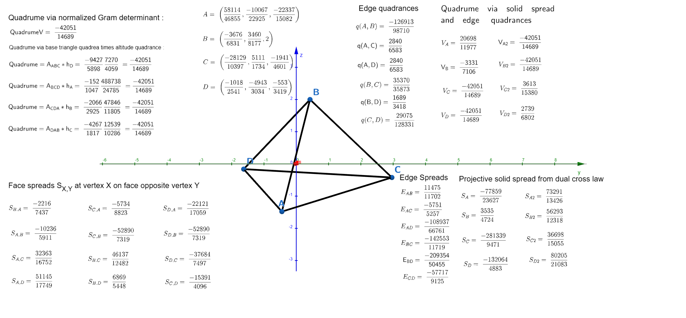

## Introduction: From Zome Models to Projective Space

Anyone who has spent time with N. J. Wildberger's *Insights into Mathematics* channel has probably stumbled across his lecture on the trigonometry of the tetrahedron, built around hands-on Zome constructions. In that video, Wildberger works in the familiar setting of the 3-dimensional affine tetrahedron and shows that the sprawling, transcendental mess of classical solid-angle trigonometry — full of arccosines, spherical excess, and dihedral angles that refuse to behave algebraically — can be replaced by something far cleaner. Using the rational trigonometry framework of **quadrance** (squared distance) and **spread** (a rational proxy for squared sine of an angle), he defines a **solid spread** $S_i$ at each vertex of a tetrahedron and a **quadrume** $\mathcal{V}$ (a normalized squared volume), and proves the elegant **Solid Spread Law**:

$$
\frac{S_1}{Q_{23}Q_{24}Q_{34}} = \frac{S_2}{Q_{13}Q_{14}Q_{34}} = \cdots = \frac{\mathcal{V}}{4\prod_{1\le a<b\le 4}Q_{ab}}
$$

That video is the jumping-off point for the paper this post is based on, now published on Zenodo ([doi.org/10.5281/zenodo.21567023](https://doi.org/10.5281/zenodo.21567023)). The natural question it leaves open is: **what happens to this trigonometry when we move from the affine tetrahedron in $\mathbb{A}^3$ to the fully projective tetrahedron living in $\mathbb{P}^3$**, whose four vertices are represented by non-null vectors in a 4-dimensional ambient vector space $V^4$ equipped with an arbitrary non-degenerate symmetric bilinear form?

This is not a cosmetic generalization. Working projectively — in the spirit of Wildberger's *Universal Hyperbolic Geometry* (UHG) — means the bilinear form need not be positive definite. We can work over Lorentzian signatures $(+,+,+,-)$, or indeed over any field of characteristic $\neq 2$. Quadrances, quadrumes, and altitudes are then allowed to be *negative*, and instead of chasing square roots of ill-defined volumes, everything reduces to polynomial identities among Gram determinants. The payoff is a projective tetrahedron trigonometry that is simultaneously more general and more algebraically transparent than its affine ancestor.

This post walks through the main definitions and theorems of the paper, building the case that the entire projective solid trigonometry of the tetrahedron falls out almost inevitably from one fact about Gram determinants: **the orthogonal component of a wedge product is the only part that contributes to a change in volume**. Once that is pinned down, the quadrume factorization, the solid spread law, the alternate spreads theorem, and the dihedral spread law all follow by direct algebraic manipulation — and every one of them was checked by exact rational computer algebra, not floating-point approximation.

  <a href="https://www.geogebra.org/m/eyveucxr" target="_blank" rel="noopener noreferrer" title="Click to launch interactive 3D model">
    
    
<em>Click image to launch the interactive GeoGebra 3D applet in a new window. Click and drag the points A, B, C, and D to see metric calculations update.</em>

  </a>

## Setting the Stage: Quadrance, Quadrance Ratios, and Gram Determinants

Everything in the paper takes place inside a 4-dimensional vector space $V^4$ over a field $\mathbb{F}$ with $\mathrm{char}(\mathbb{F}) \neq 2$, equipped with a non-degenerate symmetric bilinear form $B(u,v)$. Projective points $a_i \in \mathbb{P}^3$ are represented by non-null vectors $v_i \in V^4$ (i.e. $Q(v_i) \neq 0$), and all subspaces referenced are assumed non-degenerate so that orthogonal complements and projections behave.

**Quadrance of a vector.** The rational trigonometry quadrance of a vector is simply its self-bilinear-product:

$$
Q(v) \equiv B(v, v)
$$

**Projective quadrance between points.** Between two projective points, quadrance is defined via the normalized bilinear product:

$$
q(a_i, a_j) \equiv 1 - \frac{B(v_i, v_j)^2}{Q(v_i)Q(v_j)}
$$

This is projectively well-defined precisely because it is invariant under independent rescaling $v_i \to \lambda_i v_i$ of the representative vectors — the scale factors cancel in the ratio.

**Normalized Gram determinants.** The real workhorse of the paper is the normalized Gram determinant. For $k$ vectors $v_1,\dots,v_k \in V^4$,

$$
\mathcal{Q}_k \equiv \frac{\det(G_k)}{\prod_{i=1}^{k} Q(v_i)}, \qquad [G_k]_{ij} = B(v_i, v_j)
$$

This quantity is a projectively invariant measure of the normalized squared "content" of the parallelotope spanned by the corresponding points, and — crucially — Proposition 2.3 shows it is invariant under rescaling of the representative vectors, exactly as with $q(a_i,a_j)$. The whole point of the paper is that the tetrahedron's quadrume, face quadreas, altitude quadrances, spreads, and dihedral invariants are *all* instances of $\mathcal{Q}_k$ for $k = 2,3,4$, related to one another through a single recursive factorization identity.

**Exterior algebra viewpoint.** There is a nice basis-free way to see why this factorization exists. Writing $\det(G_k) = \langle v_1 \wedge \cdots \wedge v_k,\, v_1 \wedge \cdots \wedge v_k\rangle$ in the induced bilinear form on $\bigwedge^k V^4$, decomposing $v_k = v_k^{\parallel} + v_k^{\perp}$ relative to $U_{k-1} = \mathrm{span}(v_1,\dots,v_{k-1})$ immediately gives

$$
v_1 \wedge \cdots \wedge v_{k-1} \wedge v_k = v_1 \wedge \cdots \wedge v_{k-1} \wedge v_k^{\perp}
$$

Only the orthogonal component survives the wedge. This is the projective, coordinate-free analogue of the familiar Euclidean fact that (squared base) $\times$ (squared height) = (squared volume) — and it is the seed from which the entire paper grows.

The key computational lemma formalizing this (Lemma 2.6) states that if $U_{k-1} \subset U_k$ with $B|_{U_{k-1}}$ non-degenerate, and $v_k^{\perp}$ is the orthogonal projection of $v_k$ onto the 1-dimensional complement $U_{k-1}^{\perp}$, then

$$
\det(G_k) = \det(G_{k-1}) \cdot Q(v_k^{\perp})
$$

proved via a unit-triangular congruence transformation that block-diagonalizes the Gram matrix. Every "volume = base $\times$ height" statement in the rest of the paper is a corollary of this one identity applied at $k = 3$ and $k = 4$.

## The Quadrume Factorization Theorem

For four non-coplanar points $a_1, a_2, a_3, a_4$ represented by linearly independent vectors $v_1,\dots,v_4$, define:

- The **projective quadrume**, the normalized $4\times 4$ Gram determinant representing the squared projective 3-volume of the tetrahedron:
$$
\mathcal{V} \equiv \mathcal{Q}_4(v_1,v_2,v_3,v_4) = \frac{\det(G_4)}{Q(v_1)Q(v_2)Q(v_3)Q(v_4)}
$$

- The **projective quadrea** $A_k$ of the face opposite vertex $a_k$, the normalized $3\times 3$ Gram determinant of the remaining three vectors:
$$
A_k \equiv \mathcal{Q}_3(\{v_j\}_{j\neq k}) = \frac{\det(G_3)}{\prod_{j\neq k} Q(v_j)}
$$

- The **projective altitude quadrance** $h_k$, defined via the dual vector $n_k$ orthogonal to the opposite face (constructed explicitly through signed cofactors of the $3\times 4$ matrix of rows $v_i^T G$, per Proposition 2.7):
$$
h_k \equiv 1 - q(a_k, n_k) = \frac{B(v_k, n_k)^2}{Q(v_k)Q(n_k)}
$$

Geometrically, since $q(b, n_k) = 1$ for any point $b$ in the opposite face, the projective triple quad formula collapses to $q(a_k, b) = h_k$ for the altitude's base point — so $h_k$ genuinely plays the role of "squared altitude" in this rational framework.

The central result of the first half of the paper is that these three invariants are not independent — they satisfy an exact multiplicative identity:

> **Theorem (Quadrume Factorization Theorem).** For a non-degenerate projective tetrahedron,
> $$
> \mathcal{V} = A_k \times h_k
> $$

The proof is a direct application of the Gram factorization lemma at $k=4$: project $v_4$ onto the orthogonal complement of the face spanned by $v_1, v_2, v_3$, compute $Q(v_4^{\perp}) = B(v_4,n_4)^2/Q(n_4)$ using the explicit dual-vector formula, substitute into $\det(G_4) = \det(G_3)\cdot Q(v_4^{\perp})$, and divide through by the appropriate product of vector quadrances. What falls out is exactly $\mathcal{V} = A_4 \times h_4$, and by symmetry the same holds for every vertex. This is the projective analogue of "volume = (1/3) × base area × height," except here it is an *exact algebraic identity with no dimensional constants*, valid over any field and any signature.

## Local Vertex Invariants: Face Spreads, Pitches, and the Solid Spread

With the volume-altitude factorization in hand, the paper turns to the angular structure at each vertex. Two auxiliary invariants are introduced:

**Face spread.** $S_{i,j}$ is the projective face spread measured at vertex $a_i$, inside the triangular face opposite $a_j$:

$$
S_{i,j} \equiv \frac{A_j}{q(a_i,a_k)\cdot q(a_i,a_l)}, \qquad \{i,j,k,l\} = \{1,2,3,4\}
$$

There are twelve of these in total — one for each ordered pair of a vertex and an opposite face it doesn't lie on.

**Pitch.** $P_{j,i}$ measures how the altitude quadrance from vertex $a_i$ is distributed relative to the edge $a_ia_j$:

$$
P_{j,i} \equiv \frac{h_i}{q(a_i,a_j)}
$$

The remarkable fact — and really the heart of the paper's construction of a "solid spread" — is that multiplying a pitch by its corresponding face spread at a given vertex always produces the *same* quantity, no matter which of the three adjacent faces you use:

> **Theorem (The Solid Spread Identity).** At any vertex $a_j$,
> $$
> S_j = P_{j,i}\cdot S_{j,i} = P_{j,k}\cdot S_{j,k} = P_{j,l}\cdot S_{j,l}
> $$

The proof is short once the Quadrume Factorization Theorem is available: expanding $P_{j,i}\cdot S_{j,i}$ gives $h_iA_i$ over a product of three edge quadrances at $a_j$, and $h_iA_i = \mathcal{V}$ regardless of which opposite face $i$ was chosen. So

$$
P_{j,i}\cdot S_{j,i} = \frac{\mathcal{V}}{\prod_{x\neq j} q(a_j,a_x)}
$$

and the right-hand side manifestly doesn't depend on $i$ at all — only on the vertex $j$ and the three edges emanating from it. This gives a single, projectively invariant **solid spread** $S_j$ at each vertex, echoing Wildberger's affine solid spread but now built entirely from Gram-determinant ratios.

A useful corollary falls right out of this: the quadrume itself can be recovered from any single vertex's solid spread and its three adjacent edges,

$$
\mathcal{V} = S_i \cdot q(a_i,a_j)\cdot q(a_i,a_k)\cdot q(a_i,a_l)
$$

### The Alternate Spreads Theorem

Because each face spread $S_{i,j}$ is built from a face quadrea divided by two edge quadrances, cyclically combining ratios of face spreads causes the quadreas to cancel and leaves only edge quadrances, which then cancel among themselves. Concretely:

> **Theorem (Alternate Spreads Theorem).**
> $$
> \frac{S_{2,4}}{S_{3,4}}\cdot\frac{S_{3,2}}{S_{4,2}}\cdot\frac{S_{4,3}}{S_{2,3}} = 1
> $$

Working through the algebra: $S_{2,4}/S_{3,4} = q_{13}/q_{12}$, $S_{3,2}/S_{4,2} = q_{14}/q_{13}$, and $S_{4,3}/S_{2,3} = q_{12}/q_{14}$ — a telescoping product that collapses to $1$. There are four such relations (one for each excluded vertex), and the product of all four is again identically $1$. This is a purely combinatorial consequence of how the face spreads are built from quadreas and edges, independent of any metric signature.

### The Projective Solid Spread Law

Putting the vertex-transitivity of $S_j$ together with the observation that dividing by the three *opposite* edge quadrances (rather than the three adjacent ones) turns every denominator into the full product of all six tetrahedron edges yields the projective analogue of Wildberger's original law:

> **Theorem (Projective Solid Spread Law).**
> $$
> \frac{S_1}{q_{23}q_{24}q_{34}} = \frac{S_2}{q_{13}q_{14}q_{34}} = \frac{S_3}{q_{12}q_{14}q_{24}} = \frac{S_4}{q_{12}q_{13}q_{23}} = \frac{\mathcal{V}}{\prod_{1\le a<b\le 4} q_{ab}}
> $$

This is the exact projective counterpart of equation (1) from Wildberger's affine treatment, now stated entirely in terms of Gram-determinant-derived quadrances and holding over arbitrary fields and indefinite signatures.

## Projective Dihedral Laws

The paper's second major thread concerns **dihedral spreads** — the projective analogue of the angle between two faces meeting along a shared edge. Given the altitude $h_{i,j}$ *within* a face (computed as $A_j/q_{kl}$ for the remaining two vertices $k,l$ of that face), the dihedral spread $E_{kl}$ along edge $a_ka_l$ is defined as the spread of the right triangle formed by the vertex, the face-altitude base point, and the tetrahedron altitude:

$$
E_{k,l} \equiv \frac{h_i}{h_{i,j}} = \frac{h_i \cdot q(a_k,a_l)}{A_j}
$$

Substituting $h_i = \mathcal{V}/A_i$ from the Quadrume Factorization Theorem turns this into $E_{kl} = q_{kl}\mathcal{V}/(A_iA_j)$, and multiplying the dihedral spreads on a pair of *opposite* edges produces a beautifully symmetric identity:

> **Theorem (Projective Dihedral Spreads Theorem).**
> $$
> \frac{E_{12}E_{34}}{q_{12}q_{34}} = \frac{E_{13}E_{24}}{q_{13}q_{24}} = \frac{E_{14}E_{23}}{q_{14}q_{23}} = \frac{\mathcal{V}^2}{A_1A_2A_3A_4}
> $$

This identity holds across arbitrary fields and bilinear-form signatures — including indefinite Lorentzian metrics — with no positive-definiteness assumption required anywhere in the proof.

The paper also notes that the **dihedral cross** $C(E_{12}) \equiv 1 - E_{12}$, familiar from Universal Hyperbolic Geometry, can be written entirely as a rational function of the ambient bilinear products $B(v_i,v_j)$ — no square roots or field extensions needed:

$$
1 - E_{12} = \frac{\big(B(v_1,v_2)B(v_3,v_4) - B(v_1,v_3)B(v_2,v_4) - B(v_1,v_4)B(v_2,v_3)\big)^2}{Q(v_1)Q(v_2)Q(v_3)Q(v_4)\,A_3A_4}
$$

which, in terms of the point products $p_{ij} \equiv B(v_i,v_j)^2/(Q(v_i)Q(v_j)) = 1 - q_{ij}$, is exactly the algebraic expansion of $(\sqrt{p_{12}p_{34}} - \sqrt{p_{13}p_{24}} - \sqrt{p_{14}p_{23}})^2$ — a nice echo of the classical Ptolemy-type relations that show up throughout UHG.

Because the bilinear form need not be positive definite, quadrances, the quadrume, and the altitudes can and do come out *negative* in indefinite signatures. Rational trigonometry embraces this rather than working around it with absolute values, which keeps every identity purely polynomial and sign-consistent. In the Euclidean limit — positive-definite $B$ — the invariant $\sqrt{|\mathcal{Q}_k|}$ recovers (up to a conventional scale) the classical simplex volume via the Cayley–Menger determinant, so nothing from the familiar Euclidean picture is lost; it's simply subsumed as a special case.

## Exact Rational Verification with SymPy

Every one of these theorems was checked two ways: analytically, via the Gram-determinant algebra above, and computationally, via exact symbolic and rational computation in SymPy — never floating point. The paper reports both a fully symbolic proof of the underlying polynomial identity (using a general diagonal metric $G = \mathrm{diag}(g_0,g_1,g_2,g_3)$ and symbolic point coordinates, reproduced in full as Listing 1 of the appendix) and a concrete numerical example over $\mathbb{Q}$.

The concrete test tetrahedron $\mathcal{T}_{H1}$ uses projective coordinates under a Lorentzian signature $(+,+,+,-)$:

$$
a_1 = [-3:3:1:5],\quad a_2=[4:0:1:5],\quad a_3=[2:-4:1:5],\quad a_4=[1:0:3:5]
$$

with vector quadrances $Q(v_1)=44$, $Q(v_2)=42$, $Q(v_3)=46$, $Q(v_4)=35$. As expected in an indefinite signature, several of the resulting invariants come out negative — this is a genuine feature, not a bug, of working projectively over a non-Euclidean metric.

The quadrume evaluates exactly to $\mathcal{V} = -1445/36 \approx -40.139$, and the four factorizations $\mathcal{V} = A_k \times h_k$ check out exactly:

| Vertex $k$ | $A_k$ | $h_k$ | $A_k \times h_k$ |
|:---:|:---:|:---:|:---:|
| 1 | $229/30$ | $-7225/1374$ | $-1445/36$ |
| 2 | $275/9$ | $-289/220$ | $-1445/36$ |
| 3 | $421/45$ | $-7225/1684$ | $-1445/36$ |
| 4 | $289/2$ | $-5/18$ | $-1445/36$ |

The solid spreads resolve to $S_1 = 289/80678$, $S_2 = 425/3276$, $S_3 = 17/1218$, $S_4 = 75/107$, and dividing each by its opposite three edge quadrances reproduces the same constant, $\mathcal{V}/\prod q_{ab} = -15/282373$, for all four vertices exactly as the Solid Spread Law predicts. The Alternate Spreads Theorem's four cyclic ratios each evaluate to exactly $1$, and all three opposite-edge dihedral spread ratios collapse to the same value $21675/4241996 = \mathcal{V}^2/(A_1A_2A_3A_4)$.

Nothing here is approximate — every quantity is an exact element of $\mathbb{Q}$, and every identity is checked as exact equality of rational numbers (or, in the symbolic version, as vanishing of a difference of polynomials under `sympy.simplify`). That is precisely the spirit of rational trigonometry: replace transcendental trigonometric identities, which are only ever checkable numerically, with polynomial identities that a computer algebra system can *prove*.

## Discussion and Outlook

Stepping back, the structure of the argument is strikingly uniform. Once the recursive Gram factorization lemma is in place — "only the orthogonal component of a wedge product contributes to volume" — the quadrume factorization, the solid spread law, the alternate spreads theorem, and the dihedral spread law all become bookkeeping exercises in dividing and multiplying ratios of Gram determinants. Nothing about the argument is special to dimension 3; the paper notes this recursive philosophy extends naturally to higher-dimensional projective simplices (the pentachoron case, worked out as a companion paper, is a direct example), suggesting that the entire rational trigonometry of $n$-simplices in Universal Hyperbolic Geometry can be generated inductively from lower-dimensional Gram invariants.

There is also something conceptually satisfying about how this framework handles signature. Classical solid-angle trigonometry of the tetrahedron is inherently tied to the positive-definite Euclidean case — dihedral angles and solid angles are transcendental quantities defined via arccosines and spherical excess, and the moment you try to generalize to indefinite or non-Euclidean settings the classical formulas break down. Here, by contrast, every invariant is a *ratio of polynomials* in the ambient bilinear form, so the Lorentzian case, the Euclidean case, and every other non-degenerate signature are treated on exactly the same algebraic footing — with sign simply carrying genuine geometric information rather than being an inconvenience to work around.

For readers wanting to get a hands-on feel for how these projective invariants move as the underlying points shift, the interactive GeoGebra model above is a good place to start — dragging the vertices around and watching the quadreas and quadrances update in real time makes the "base × height" flavor of the Quadrume Factorization Theorem much more intuitive than the algebra alone.

If you found this interesting, the original inspiration — Wildberger's affine treatment of the tetrahedron and Zome models — is well worth watching in full: 



::: {.callout-note}
## Citing This Work
This post summarizes the results of the published paper:

> J. D. Coady, *On the Projective Trigonometry of the Tetrahedron: Solid Spreads, Dihedral Laws, and Factorization*, Zenodo, 2026. [https://doi.org/10.5281/zenodo.21567023](https://doi.org/10.5281/zenodo.21567023)
:::

## References

1. N. J. Wildberger. *Universal Hyperbolic Geometry I: Trigonometry*. Geometriae Dedicata, 163(1):109–147, 2013. arXiv:0909.1377 [math.MG].
2. N. J. Wildberger. *Divine Proportions: Rational Trigonometry to Universal Geometry*. Wild Egg Books, Sydney, 2005.
3. N. J. Wildberger. *Three dimensional geometry, ZOME, and the elusive tetrahedron*. YouTube video, Insights into Mathematics channel, July 31, 2012. [https://www.youtube.com/watch?v=rzUtdwh2rj0](https://www.youtube.com/watch?v=rzUtdwh2rj0)
4. J. D. Coady. *On the Projective Trigonometry of the Tetrahedron: Solid Spreads, Dihedral Laws, and Factorization*. Zenodo, 2026. [https://doi.org/10.5281/zenodo.21567023](https://doi.org/10.5281/zenodo.21567023)
5. J. D. Coady. *On the Projective Quadrume and the Recursive Factorization of Projective Simplices*. Zenodo, 2026. [https://doi.org/10.5281/zenodo.21523417](https://doi.org/10.5281/zenodo.21523417)
6. J. D. Coady. *On the Trigonometry of the Pentachoron: Hypersolid Spreads and 4-Simplex Factorization*. Zenodo, 2026. [https://doi.org/10.5281/zenodo.21541327](https://doi.org/10.5281/zenodo.21541327)
