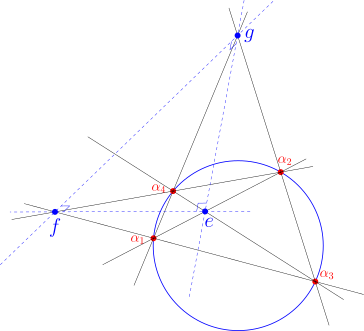

## Two geometries, one hyperbola

Norman Wildberger's **Universal Hyperbolic Geometry (UHG)** replaces the transcendental machinery of classical hyperbolic geometry — distance, angle, exponentials — with two purely algebraic quantities: **quadrance** $q$ (a rational stand-in for distance) and **spread** $S$ (a rational stand-in for angle). It also comes paired with **chromogeometry**, a framework in which the same plane can be measured with three different "colored" metrics — red (hyperbolic), blue, and green — each governed by its own quadratic form. The green metric, in particular, is built around the multiplicative unit curve $xy = 1$: the standard hyperbola.

A new paper by John D. Coady finds an unexpected bridge between these two worlds [@coady2026reciprocalparallax]. Starting from nothing but a **null quadrangle** — four points sitting on the red geometry's null conic — and using only red-geometry tools (perpendicularity, polarity, spread and quadrance), the paper derives a construction whose quadrances obey exactly the defining law of the green unit hyperbola:

$$q \longleftrightarrow \frac{1}{q}.$$

No green geometry is imported from outside. The multiplicative symmetry of $xy=1$ falls straight out of red, null-point geometry on its own.

## Setting the stage: the fully-right diagonal triangle

Take four distinct null points $\alpha_1, \alpha_2, \alpha_3, \alpha_4$ and form their three diagonal points:
 
$$e = (\alpha_1\alpha_2)(\alpha_3\alpha_4), \quad f = (\alpha_1\alpha_3)(\alpha_2\alpha_4), \quad g = (\alpha_1\alpha_4)(\alpha_2\alpha_3).$$

A classical UHG result shows these three points form a **fully-right diagonal triangle**: each vertex is the pole of the opposite side, so $e^{\perp} = fg$, $f^{\perp} = ge$, and $g^{\perp} = ef$. Every side is perpendicular to the line joining the other two vertices — the triangle is "fully-right" in all three corners at once.

{#fig-diagtriangle fig-align="center" width="100%"}

Relabel the interior diagonal point $e$ as $a_3$, and let $a_1 = \alpha_4$ be one of the original null points. From $a_3$, the two perpendicular sides of the diagonal triangle — $a_3g$ and $a_3f$ — become the scaffolding for the next construction.

## Building two complementary right triangles

Define two auxiliary points projectively:

$$a_2 \equiv (fa_1)\cdot(a_3g), \qquad a_4 \equiv (ga_1)\cdot(a_3f).$$

Because the diagonal triangle is fully-right, a short polarity argument shows that $a_1a_2 \perp a_2a_3$ and $a_1a_4 \perp a_3a_4$. In other words, this single construction produces **two right triangles sharing a common vertex** $a_3$ and a common leg $a_1a_3$: triangle $a_1a_2a_3$, right-angled at $a_2$, and triangle $a_1a_3a_4$, right-angled at $a_4$.

{#fig-parallax fig-align="center" width="100%"}

These are the **complementary right parallax triangles** of the title — "parallax" because each one is governed by Wildberger's *Right Parallax Theorem*, which says that a right triangle with spreads $0, S, 1$ has a single defined quadrance

$$q = \frac{S-1}{S}.$$

## The main result: reciprocal quadrances

Let $q_{23} = q(a_2, a_3)$ and $q_{34} = q(a_3, a_4)$ be the quadrances along the shared vertex $a_3$. The paper's central theorem is remarkably clean:

$$q_{23}\, q_{34} = 1, \qquad \text{equivalently} \qquad q_{34} = \frac{1}{q_{23}}.$$

The proof is short and elegant. Since $a_3a_2 \perp a_3a_4$, the angle at $a_3$ in triangle $a_2a_3a_4$ has spread exactly $1$. Applying the *Triple Spread Theorem* — which reduces to $a + b = 1$ whenever the third spread is $1$ — to the two spreads $S_2 = S(a_1a_3, a_3a_2)$ and $S_4 = S(a_1a_3, a_3a_4)$ gives the complementary relation $S_2 + S_4 = 1$. Feeding both spreads through the Right Parallax formula and simplifying, the two resulting quadrances multiply to exactly $1$.

So the two "halves" of this construction — the triangle above $a_3$ and the triangle below it — are locked together by a strict reciprocal law: whatever quadrance one has, the other is its multiplicative inverse.

## An invariant quadrea of exactly one

This reciprocal law has an immediate and pleasing consequence. The triangle $a_2a_3a_4$ is right-angled at $a_3$ (spread $1$ there), so its **quadrea** — the UHG area-analogue $\mathcal{A} = q_1q_2S_3$ — simplifies to just the product of its two legs' quadrances:

$$\mathcal{A}(a_2, a_3, a_4) = q_{23}\cdot q_{34}\cdot 1 = q_{23}\cdot\frac{1}{q_{23}} = 1.$$

No matter which null quadrangle you start with, this particular right triangle always has quadrea exactly $1$ — a clean universal constant, in the same spirit as the invariants Coady catalogues elsewhere in his UHG work.

## A self-dual fixed point

The map $q \mapsto 1/q$ is an involution — applying it twice returns you to where you started — so it's natural to ask about its fixed points. Algebraically $q = 1/q$ forces $q^2 = 1$, so $q = \pm 1$. Checking against the Right Parallax relation rules out $q=1$ as geometrically realizable here (it would force $S = S-1$, a contradiction), leaving a single distinguished fixed point:

$$q = -1, \qquad S = \frac{1}{2}.$$

At this point $q_{23} = q_{34} = -1$: the two complementary triangles become perfectly symmetric twins. Using the Projective Pythagoras theorem, the paper also shows that the hypotenuse quadrance $q(a_2,a_4) = q + 1/q - 1$ is *maximized* along the negative branch precisely at this fixed point, attaining the value $-3$. The self-dual configuration isn't just symmetric — it's an extremal point of the whole family.

## Why this looks like the green hyperbola

The relation $q_{23}q_{34} = 1$ says that every admissible pair of quadrances from this construction lies on the curve $xy = 1$ — the defining equation of the "green unit circle" in Wildberger's chromogeometry, the geometry built around diagonal quadratic forms and multiplicative structure. What makes this noteworthy is *where it came from*: nothing about the construction invoked green geometry. It was built entirely from red-geometry ingredients — null points, polarity, perpendicularity, complementary spreads — and yet it reproduces the green geometry's defining multiplicative law.

The paper goes further, showing that the spread parameter $S$ itself gives a rational parametrization of the hyperbola:

$$x = \frac{S-1}{S}, \qquad y = \frac{S}{S-1},$$

with $xy=1$ automatically satisfied. This is reminiscent of — though entirely independent of — the classical Lobachevsky–Bolyai angle-of-parallelism formula $\tan(\theta/2) = e^{-d}$, which links hyperbolic distance to exponential decay. Where the classical formula needs transcendental functions, the UHG construction gets an equivalent multiplicative structure using nothing but rational relations between null points.

## A projective reading: cross-ratio and involutions

Since UHG quadrance can itself be understood as a cross-ratio invariant, the paper closes by placing the reciprocal map $q \mapsto 1/q$ in its natural projective home: it is one of the classical **anharmonic transformations** generated by permuting four projective points. Under this lens, the reciprocal parallax symmetry isn't a coincidence of formulas — it's a visible trace of the underlying cross-ratio symmetry of the four null points the whole configuration was built from.

## Takeaway

Starting from four null points and nothing more than perpendicularity and polarity, this construction produces a strict reciprocal law $q \leftrightarrow 1/q$, a universal quadrea of $1$, and a distinguished self-dual fixed point at $q=-1$. Along the way, the standard multiplicative hyperbola $xy=1$ — usually associated with an entirely different "color" of geometry — emerges organically from red null-point geometry alone. It's a small but suggestive hint that UHG's red, blue, and green geometries may be more tightly interwoven than their separate axiomatic definitions suggest.

---

*This post summarizes results from J. D. Coady, "From Null Quadrangles to the Hyperbola xy = 1: Reciprocal Parallax Symmetry in Universal Hyperbolic Geometry" (2026), building on the foundational work of N. J. Wildberger on Universal Hyperbolic Geometry and Chromogeometry.*

## References

::: {#refs}
:::
