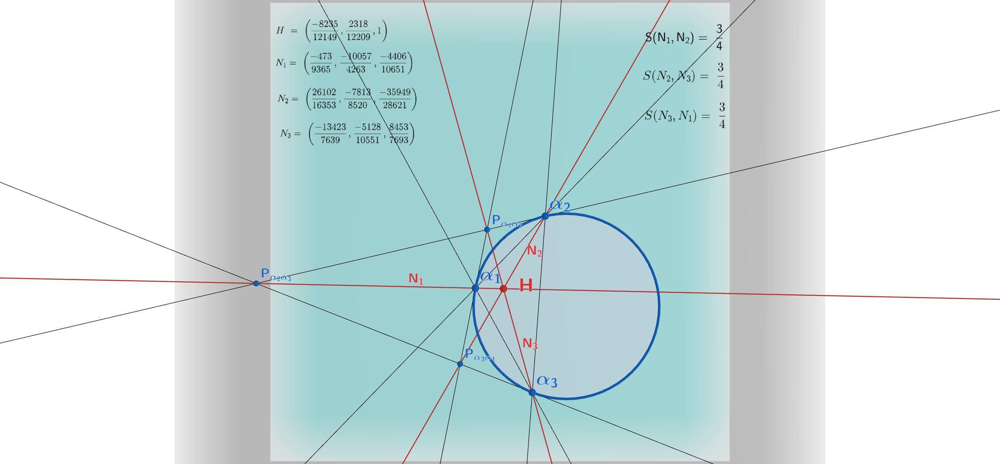

## A geometry without distance

Most of us learn hyperbolic geometry, if we learn it at all, through models full of circles, curves, and transcendental functions — Poincaré disks, tanh and cosh, limits everywhere. Norman Wildberger's **Universal Hyperbolic Geometry (UHG)** throws all of that out. It rebuilds hyperbolic geometry on purely algebraic foundations: points and lines are proportions, and the two fundamental measurements — **quadrance** (a stand-in for distance) and **spread** (a stand-in for angle) — are defined by simple rational formulas built from a quadratic form. No transcendentals, no limits. Just projective geometry and arithmetic.

Sitting inside this framework is a very special set of points: the **null points**, which lie exactly on the quadric $x^2 + y^2 - z^2 = 0$. These are the points where quadrance and spread blow up — the "boundary" of the geometry, analogous to points at infinity in hyperbolic space. You might expect this boundary to be a wild, undefined no-man's-land. A recent paper by John D. Coady argues the opposite: configurations of three or four null points generate a **highly structured, finite, and rigid family of rational constants** — numbers that show up again and again no matter which null points you start with.

This post walks through the two central discoveries of that paper, and the surprisingly large catalogue of numbers they generate.

## Null triangles and their orthocenters

Take three distinct null points $\alpha_1, \alpha_2, \alpha_3$ — a "nil triangle." Just as in ordinary Euclidean geometry, you can drop altitudes from each vertex perpendicular to the opposite side, and they meet at a single point: the **orthocenter** $h$.

Now measure the spread between each pair of lines joining $h$ to the vertices. In Euclidean geometry, the analogous question (angles from the centroid to the vertices) has no fixed answer — it depends on the triangle's shape. But for nil triangles in UHG, something remarkable happens:

$$S(h\alpha_i, h\alpha_j) = \frac{3}{4} \quad \text{for every } i \neq j.$$

*Every* nil triangle, regardless of which three null points you choose, produces this exact same spread. It's a "constant of nature" for the geometry — independent of moduli, immune to how you deform the configuration. The paper calls this the first **primitive universal invariant**.

Interestingly, this echoes a classical fact from Euclidean geometry: the three lines from a triangle's centroid to its vertices are always separated by exactly $120°$, which corresponds to a spread of $3/4$. The null-triangle orthocenter reproduces that same universal spread — a hyperbolic shadow of a familiar Euclidean fact.

### Geogebra example: Orthocenter of Nil-Triangle Construction

```{=html}
<div style="text-align: center; margin: 20px 0;">
  <a href="https://www.geogebra.org/m/p2ab7ytz" target="_blank" rel="noopener noreferrer" title="Click to launch interactive 3D model">
    
    <p style="font-size: 0.9rem; color: #666; margin-top: 8px;"><em>Click image to launch the interactive GeoGebra 3D applet in a new window. Click and drag the points to see metric calculations update.</em></p>
  </a>
</div>

## Four points, four orthocenters, one triangle-quadrea

The real richness appears once you move from three null points to four: $\alpha_1, \alpha_2, \alpha_3, \alpha_4$. Leaving out one vertex at a time gives four different nil triangles, and hence four orthocenters $h_1, h_2, h_3, h_4$ — together called the **orthic quadrangle**.

Pick any three of these four orthocenters and form a triangle. Compute its **quadrea** — a UHG quantity that plays a role analogous to (squared) area, defined by $q_{12}q_{13}S_1 = \mathcal{A}$ for two quadrances and their included spread. The result:

$$\mathcal{A}(h_i, h_j, h_k) = \frac{16}{27}.$$

Every one of the four possible orthocenter-triangles gives exactly this value. This is the paper's second primitive invariant, and it doesn't come from the original four null points directly — it's a property of the *derived* orthocentric system.

What's striking is that this happens despite the orthocentric system being, in a sense, "unstable": the individual diagonal spreads of the quadrilateral $h_1h_2h_3h_4$ turn into messy, unsimplifiable rational functions of the configuration's cross-ratio parameter $\lambda$. Yet buried inside that mess, the same two absolute constants — $3/4$ and $16/27$ — resurface every time.

## Recovering a classical result

Long before this paper, Wildberger had already found a striking identity for four null points directly (not via their orthocenters). Any nil quadrangle has three **diagonal spreads** $P$, $R$, $T$, and they always satisfy:

$$PR + RT + TP = 48, \qquad PRT = 64,$$

no matter which four null points you pick. Coady's paper reframes these two numbers — long treated as isolated curiosities — as *algebraic descendants* of the same $3/4$ and $16/27$ structure that governs the orthocentric system. In other words, $48$ and $64$ aren't really primitive at all; they fall out of a deeper underlying architecture.

## A whole catalogue of constants

Once you start turning the crank — combining null points, orthocenters, poles, reflected points, and diagonal points using the standard UHG toolkit (join, meet, polarity, quadrance, spread, quadrea) — dozens of further universal rational values emerge. A sample from the paper's catalogue:

| Value | What it measures |
|---|---|
| $4/3$ | quadrance from orthocenter $h$ to the pole of the opposite side |
| $-16/9$ | quadrance between a pole and its reflection through $h$ |
| $-1/3$ | quadrance from $h$ to the foot of an altitude |
| $16/25$ | spread between lines joining pairs of altitude-feet |
| $32/27$ | quadrea of a mixed pole/orthocenter triangle |
| $64/729$ | product of three quadrea values from the orthic system |
| $8/27$ | quadrea of a quadrangle formed by a diagonal point and three orthocenters |

None of these depend on which null points you started with. They're all pinned down purely by the *incidence structure* of the configuration — which points lie on which lines, and how polarity connects them.

## Why does this happen? A conjecture about finite generation

The paper's boldest claim is structural rather than computational: it conjectures that **every** universal rational invariant obtainable this way lives inside a very small extension of the integers — specifically the "5-smooth" localization $\mathbb{Z}[1/2, 1/3, 1/5]$, the ring of fractions whose denominators only involve the primes 2, 3, and 5. Empirically, every single value in the catalogue — $3/4$, $16/27$, $48$, $64$, and all the rest — fits inside this ring.

The intuition offered is that the base invariants ($3/4$, and the nil-triangle structure generally) are governed by the primes 2 and 3, while certain quadratic relations that appear in the geometry (an "Isosceles Triangle" spread equation) introduce a controlled dose of the prime 5. Nothing wilder ever seems to enter. If true, this points to a kind of *finite generation* phenomenon: the boundary of hyperbolic space, instead of being an unruly infinite mess, behaves like a small, tightly generated algebraic system.

## Climbing a dimension: from $16/27$ to a 3D family

The paper closes with a tantalizing extension into projective 3-space. Take a **null tetrahedron** — four null points in $\mathbb{P}^3$ instead of the plane — and build its **orthic tetrahedron** from the orthocenters of its four triangular faces. Conjecturally, all four faces of this orthic tetrahedron again share one common quadrea $\mathcal{A}_{\text{orthic}}$, and this value is bounded:

$$\frac{5}{54} \le \mathcal{A}_{\text{orthic}} < \frac{16}{27}.$$

The lower bound $5/54$ is attained exactly when the orthic tetrahedron is "orthically regular," and the upper bound $16/27$ — our familiar planar constant — appears as the *degenerate limiting case*, when the tetrahedron flattens into the plane and collapses back into the ordinary orthic quadrangle. Under this reading, $16/27$ isn't really a standalone planar curiosity at all: it's the boundary shadow of a genuinely three-dimensional invariant family, glimpsed at the edge where 3D degenerates into 2D.

This conjecture is currently supported only by numerical experiment (no full symbolic proof yet), and the paper flags it as the target of a follow-up work on 3D projective UHG.

## Takeaway

What makes this catalogue compelling isn't any single formula — it's the pattern. A configuration of three or four points, sitting exactly on the boundary where the usual metrical machinery of distance and angle *fails* to be defined, turns out to encode a small, closed, rational algebra of constants. $3/4$ and $16/27$ behave like fundamental constants of this boundary geometry, with $48$, $64$, and dozens of other values falling out as their algebraic consequences. It's a nice reminder that "undefined" and "unstructured" are not the same thing — sometimes the most rigid mathematics lives exactly at the edge.

---

*This post summarizes results from J. D. Coady, "Invariant Structures of Three and Four Null Points in Universal Hyperbolic Geometry" (2026), building on the foundational work of N. J. Wildberger on Universal Hyperbolic Geometry.*
